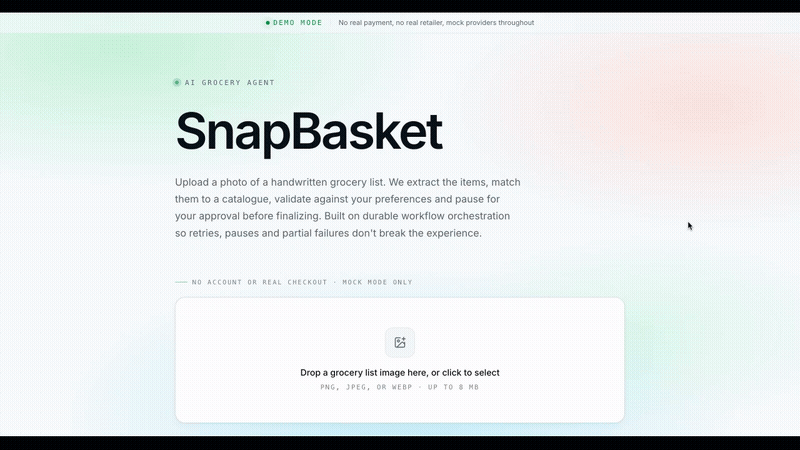
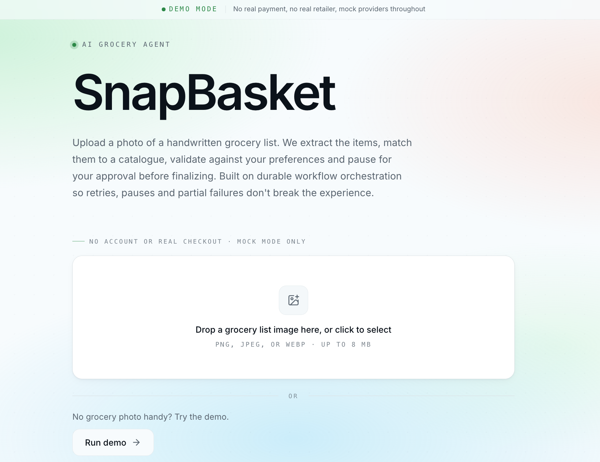
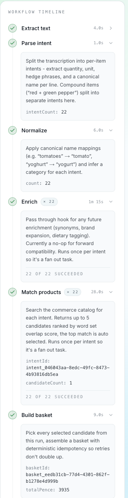
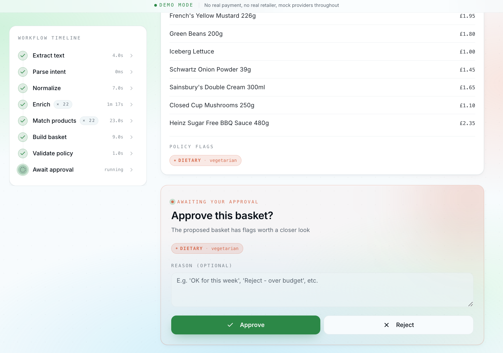
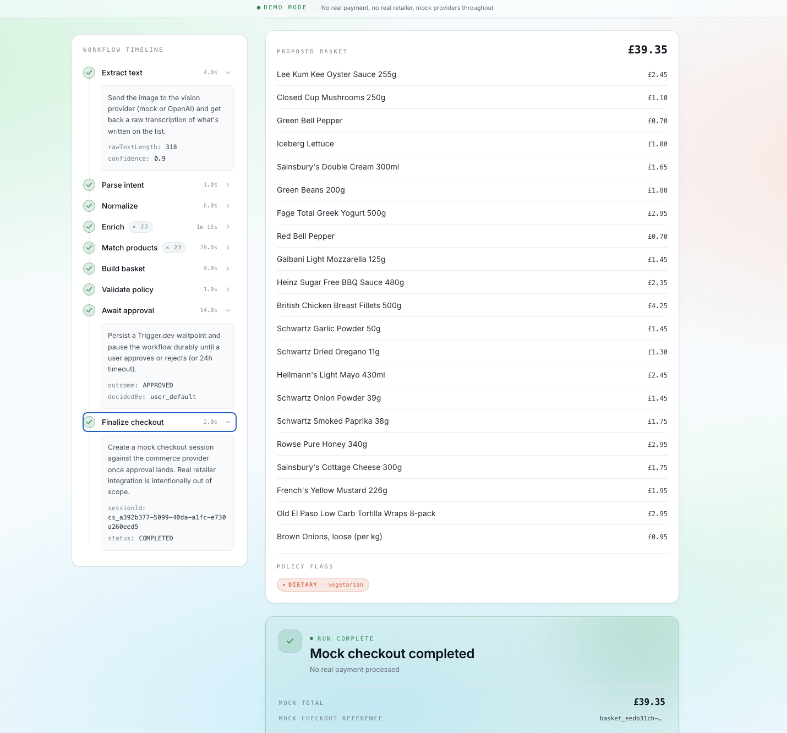

# 🛒 SnapBasket - AI grocery agent

Upload a photo of a handwritten grocery list and a Trigger.dev workflow extracts the items, matches them to a mock commerce catalogue, validates them against user policy and pauses durably for human approval before finalising a mock checkout.

The interesting layer is everything around the LLM call - durable retries, idempotency, durable pauses, provider abstraction and a clear safety boundary between _the agent proposes_ and _the user confirms_.

[](https://github.com/Cash-Codes/AI-grocery-agent-snapbasket/actions/workflows/ci.yml)

[](#)

[](#)
[](#)
[](#)
[](#)
[](#)
[](#)
[](#)

## 🌐 Live Demo

🔗 https://snapbasket-699916771145.europe-west2.run.app

Click **Run demo** on the homepage to exercise the full workflow against a bundled handwritten grocery list. The first run uses real OpenAI vision (~30-60s), every subsequent click on the same image shows the cached result instantly.

## 🎥 Demo



## Live Flow

```
Upload photo (or click Run demo)
  → POST /api/upload (sha256 dedup)
    → POST /api/runs
      → tasks.trigger("snapbasket.run", payload)
        → snapbasketWorkflow runs on Trigger.dev cloud
          → ingestImage → extractRawTextFromImage (OpenAI / mock)
            → parseGroceryIntent → normalizeItems
              → enrichItems × N → matchProducts × N (catalog search)
                → buildBasket → validateBasketPolicy
                  → requireHumanApproval (durable waitpoint)
                    ⏸ AWAITING_APPROVAL
                  ⟵ POST /api/runs/[runId]/approve
                    → persist userConsent (audit-before-completion)
                    → wait.completeToken (resumes the workflow)
                  → finalizeMockCheckout
                → COMPLETED → Receipt UI
```

The Next.js app (Cloud Run) and the workflow tasks (Trigger.dev cloud) are **two separate runtimes** that share state via Turso (managed libsql/SQLite over HTTP).

## ✨ Features

- **Real handwriting OCR** via OpenAI GPT-4o vision (with a deterministic mock provider as the dev/test default)
- **Durable workflow orchestration** via Trigger.dev - workflow runs are persisted at every step
- **Per task retries with deterministic idempotency keys** - retries can't double charge or duplicate work
- **Fan out concurrency** for `matchProducts` and `enrichItems` (one task invocation per intent, queue-managed)
- **Real waitpoint for human approval** (`wait.createToken` / `wait.forToken`) - not a polling hack
- **Policy validation** with 6 flag kinds: budget exceeded, allergen detected, dietary violation, low-confidence match, unavailable product, substitution applied
- **Mock UCP style commerce provider** with ~89 catalog items - search, basket, checkout, order status
- **Audit before completion** - user consent is persisted before the workflow waitpoint completes, so an audit trail exists even if the SDK call fails
- **Live workflow timeline** with per step accordion details and aggregated invocation counts for fan out tasks
- **Run progress bar** - smooth fan out aware progress so the page never feels idle during long matchProducts steps
- **Demo cache** - same bundled image dedups via sha256, so repeated demo clicks redirect to the cached run instead of triggering new OpenAI calls
- **Stateful ephemeral** - bundled demo image, stable Turso, free tier friendly

## 🖼️ Screenshots






## 🧠 Tech Stack

**App**

| Technology   | Version | Role                                                  |
| ------------ | ------- | ----------------------------------------------------- |
| Next.js      | 16      | App Router, server components, API routes             |
| React        | 19      | UI framework                                          |
| TypeScript   | 5       | Strict mode + `exactOptionalPropertyTypes`            |
| Tailwind CSS | 4       | Utility-first styling, oklch() colour space           |
| shadcn/ui    | latest  | Component primitives (Button, Card, Skeleton, ...)    |
| Lucide       | 1       | Icon set                                              |
| Zod          | 4       | Schema validation everywhere (env, payloads, catalog) |

**Database**

| Technology     | Version | Role                                                                     |
| -------------- | ------- | ------------------------------------------------------------------------ |
| @libsql/client | 0.17    | libsql/SQLite client (async) - works against Turso or local files        |
| drizzle-orm    | 0.45    | Typed query builder + migrator                                           |
| drizzle-kit    | 0.31    | Schema generator + Studio                                                |
| Turso          | managed | Hosted libsql for production - shared state between web tier and workers |

**Workflow / orchestration**

| Technology         | Version | Role                                                          |
| ------------------ | ------- | ------------------------------------------------------------- |
| Trigger.dev        | v4      | Durable workflow runtime                                      |
| @trigger.dev/sdk   | 4.4     | `task()`, `tasks.trigger()`, `wait.forToken()`                |
| @trigger.dev/build | 4.4     | Bundling extensions (`additionalPackages`, `additionalFiles`) |
| OpenTelemetry      | 1.9     | `withSpan()` wraps every task for tracing                     |

**AI / vision**

| Technology    | Role                                         |
| ------------- | -------------------------------------------- |
| OpenAI GPT-4o | Vision provider for handwriting OCR          |
| Mock vision   | Deterministic fallback for local dev / tests |

**Testing**

| Technology          | Version | Role                                       |
| ------------------- | ------- | ------------------------------------------ |
| Vitest              | 4       | Test runner with native ESM, V8 coverage   |
| @vitest/coverage-v8 | 4       | Coverage reporter (local-only, no CI gate) |

**Infrastructure**

| Technology           | Role                                               |
| -------------------- | -------------------------------------------------- |
| Docker (multi-stage) | Web tier image build (deps → build → runtime)      |
| Google Cloud Run     | Production hosting for the Next.js app             |
| Trigger.dev cloud    | Hosts the workflow tasks (separate runtime)        |
| Turso                | Managed libsql for shared production state         |
| GCP Secret Manager   | Holds Trigger / OpenAI / Turso credentials         |
| GitHub Actions       | CI pipeline (typecheck, lint, format, test, build) |

## Architecture

```
AI-grocery-agent-snapbasket/
├── app/                              Next.js App Router
│   ├── layout.tsx                    Global chrome (banner, gradient mesh, fonts)
│   ├── page.tsx                      Homepage (Hero + HowItWorks + WhyThisExists)
│   ├── globals.css                   Theme tokens, animations, utilities
│   ├── api/
│   │   ├── health/route.ts           GET /api/health (Cloud Run health probe)
│   │   ├── upload/route.ts           POST /api/upload (multipart image)
│   │   ├── images/[imageId]/route.ts GET /api/images/[imageId] (binary stream)
│   │   ├── runs/
│   │   │   ├── route.ts              POST /api/runs (start a run for an imageId)
│   │   │   ├── demo/route.ts         POST /api/runs/demo (bundled-image flow)
│   │   │   └── [runId]/
│   │   │       ├── route.ts          GET /api/runs/[runId] (polled by UI)
│   │   │       └── approve/route.ts  POST /api/runs/[runId]/approve
│   └── runs/[runId]/                 Run-detail page
│       ├── page.tsx                  Async params wrapper
│       └── run-view.tsx              Client polling + side-by-side layout
├── components/                       UI components
│   ├── Hero.tsx, HowItWorks.tsx, WhyThisExists.tsx, DemoBanner.tsx
│   ├── UploadCard.tsx                Drag-drop + file picker with state machine
│   ├── RunDemoButton.tsx             Demo CTA with arrow micro-interaction
│   ├── RunImagePreview.tsx           Source image preview on the run page
│   ├── RunProgress.tsx               Fan-out-aware progress bar
│   ├── WorkflowTimeline.tsx          Aggregated event timeline with accordions
│   ├── StatusBadge.tsx               Pulsing badge for live statuses
│   ├── IntentList.tsx                Detected items + matched product
│   ├── BasketReview.tsx              Proposed basket + policy flags
│   ├── ApprovalCard.tsx              Awaiting-approval form
│   ├── ReceiptCard.tsx               Mock checkout receipt
│   ├── PolicyFlagList.tsx            Coloured pills per flag kind
│   └── ui/                           shadcn primitives (button, card, ...)
├── lib/
│   ├── config/env.ts                 Zod-validated env (fail-fast on bad shape)
│   ├── db/
│   │   ├── schema.ts                 11 tables (images, runs, intents, ...)
│   │   ├── client.ts                 getDb() + ensureMigrated() (libsql + drizzle)
│   │   ├── migrate.ts                Standalone CLI migrator
│   │   └── index.ts                  Re-exports
│   ├── domain/
│   │   ├── schemas.ts                Zod schemas (PolicyFlag union, etc.)
│   │   └── types.ts                  Inferred + manual TypeScript types
│   ├── parser/
│   │   ├── intent.ts                 parseGroceryLine + parseGroceryText
│   │   └── normalize.ts              Canonical-name table + category rules
│   ├── policy/
│   │   ├── validate.ts               validateBasket(ctx) → BasketPolicyResult
│   │   ├── user-profile.ts           UserProfile type (allergens, dietary)
│   │   └── index.ts
│   ├── providers/
│   │   ├── vision/                   VisionProvider abstraction (mock + openai)
│   │   └── commerce/                 UCP-inspired mock + 89-item catalog
│   ├── server/
│   │   ├── api.ts                    NextResponse helpers (badRequest, notFound)
│   │   ├── upload.ts                 ingestImage() (validation + sha256 dedup)
│   │   └── workflow-trigger.ts       triggerSnapbasketRun() wrapper
│   ├── observability/
│   │   ├── logger.ts                 Structured JSON logger
│   │   ├── correlation.ts            corrId helpers
│   │   ├── events.ts                 emitWorkflowEvent() into workflowEvents table
│   │   └── otel.ts                   withSpan() wrapper
│   ├── trigger/
│   │   ├── retry.ts                  STANDARD_RETRY / SHORT_RETRY / NO_RETRY
│   │   └── fault-injection.ts        maybeInjectFault() (MOCK_FAULT_RATE proof)
│   └── ui/                           Format helpers, status colour map, polling hook
├── trigger/                          Trigger.dev workflow tasks (FLAT layout)
│   ├── workflow.ts                   snapbasketWorkflow root - drives the pipeline
│   ├── ingestImage.ts                Bookkeeping task (sha256 already done by /api/upload)
│   ├── extractRawTextFromImage.ts    Calls vision provider; STANDARD_RETRY
│   ├── parseGroceryIntent.ts         parseGroceryText() over the raw transcription
│   ├── normalizeItems.ts             Canonical-name + category inference
│   ├── enrichItems.ts                Per-intent fan-out (no-op, future hook)
│   ├── matchProducts.ts              Per-intent fan-out + queue concurrency=4
│   ├── buildBasket.ts                Picks selected candidates → calls commerceProvider.createBasket
│   ├── validateBasketPolicy.ts       Runs the policy validator + persists flags
│   ├── requireHumanApproval.ts       wait.createToken + wait.forToken<Decision>(tokenId)
│   └── finalizeMockCheckout.ts       commerceProvider.createCheckoutSession
├── drizzle/                          Migration files (shipped to Trigger.dev workers too)
│   └── meta/_journal.json
├── public/demo/grocery-note-sample.png    Bundled handwritten grocery list
├── tests/                            Vitest test suite (95 tests / 16 files)
│   ├── unit/                         Pure-function tests (parser, policy, env, scoring)
│   ├── integration/                  Route handler tests with mocked SDKs
│   └── __mocks__/server-only.ts      Vitest alias for the "server-only" package
├── .github/workflows/ci.yml          GitHub Actions CI
├── trigger.config.ts                 Trigger.dev project + build extensions
├── next.config.ts                    Next.js (output: 'standalone')
├── pnpm-workspace.yaml               supportedArchitectures (linux x64 for cross-deploy)
├── Dockerfile                        Multi-stage build for Cloud Run
└── .dockerignore                     Excludes data/, tests/, _private docs, .env*
```

**Request pipeline:**

```
Browser
  → POST /api/upload  (multipart)
    → ingestImage(): MIME + size + sha256 dedup
    → 201 / 200 with imageId

  → POST /api/runs  (or /api/runs/demo)
    → INSERT runs (status=PENDING)
    → triggerSnapbasketRun() → tasks.trigger("snapbasket.run", payload)
    → 201 with { runId, correlationId, triggerRunId }
    → router.push(`/runs/[runId]`)

  Trigger.dev cloud worker (separate runtime):
    → snapbasketWorkflow.run(payload)
      → ingestImage → extractRawTextFromImage → parseGroceryIntent
      → normalizeItems
      → enrichItems × N (fan-out, concurrency 1-N)
      → matchProducts × N (queue concurrencyLimit=4, scored token search)
      → buildBasket → validateBasketPolicy
      → requireHumanApproval: wait.forToken<Decision>(token)
        ⏸ paused; UI shows AWAITING_APPROVAL

  → POST /api/runs/[runId]/approve  (user clicks Approve)
    → INSERT userConsents (audit-before-completion)
    → wait.completeToken(tokenId, decision)
    → Workflow resumes:
      → finalizeMockCheckout
      → Run status = COMPLETED

  Run-detail page polls GET /api/runs/[runId] every ~2s:
    → returns { run, intents, candidatesByIntent, basket, items, policy,
                checkoutSession, events }
    → UI re-renders: timeline, items, basket, receipt
```

## Setup

### Prerequisites

- Node.js 22+
- pnpm 10+
- A Trigger.dev account (free) - https://cloud.trigger.dev
- (Optional) An OpenAI API key for real handwriting OCR
- (Optional) A Turso account for shared remote state (only needed for production deploys)

### 1. Clone and install

```bash
git clone https://github.com/Cash-Codes/AI-grocery-agent-snapbasket.git
cd AI-grocery-agent-snapbasket
pnpm install
```

### 2. Configure environment

```bash
cp .env.example .env
```

Edit `.env`:

```env
# Trigger.dev (https://cloud.trigger.dev)
TRIGGER_PROJECT_REF=proj_xxxxxxxxxx
TRIGGER_API_KEY=tr_pat_...           # Personal Access Token (used by trigger:dev/deploy CLI)
TRIGGER_SECRET_KEY=tr_dev_...        # Project secret key (used by the app to enqueue runs)

# OpenAI (optional - mock vision is the default)
OPENAI_API_KEY=sk-...
OPENAI_MODEL=gpt-4o

# Mock-mode controls
MOCK_FAULT_RATE=0                    # 0 = never fault. Set to 1.0 for the retry-then-success demo.

# Local DB (optional override - defaults to ./data/snapbasket.db)
# DATABASE_URL=./data/snapbasket.db
```

The schema is permissive - every Trigger.dev / OpenAI / Turso field is optional, so you can run the app with mock providers and a local SQLite file with no third-party accounts.

### 3. Apply migrations

```bash
mkdir -p data
pnpm db:migrate
```

### 4. Start the dev environment

You need two terminals:

```bash
# Terminal 1: Trigger.dev local worker (runs trigger/ tasks against your dev environment)
pnpm trigger:dev

# Terminal 2: Next.js
pnpm dev
```

Open http://localhost:3000 and click **Run demo**.

### 5. Trigger your first real run

Replace the demo image with your own to see real handwriting OCR (requires `OPENAI_API_KEY`):

```bash
cp /path/to/your-grocery-list.jpg public/demo/grocery-note-sample.png
# refresh the page, click Run demo again
```

## Docker (local testing)

```bash
# Build the image
docker build -t snapbasket:local .

# Run it
docker run --rm -p 3000:3000 \
  -e PORT=3000 \
  -e MOCK_FAULT_RATE=0 \
  -e TRIGGER_SECRET_KEY=tr_dev_... \
  -e TRIGGER_PROJECT_REF=proj_... \
  -e OPENAI_API_KEY=sk-... \
  snapbasket:local

curl http://localhost:3000/api/health
# {"ok":true,"service":"snapbasket","ts":"..."}
```

The container uses Next.js standalone output and a non-root `nextjs` user. The `data/` directory is pre-created with correct ownership so the lazy `getDb()` migration works on cold start.

| Flag                        | Purpose                                                      |
| --------------------------- | ------------------------------------------------------------ |
| `-p 3000:3000`              | Map container port to host                                   |
| `-e PORT=3000`              | Cloud Run injects this; explicit for local                   |
| `-e TRIGGER_SECRET_KEY=...` | Required to call `tasks.trigger()` against Trigger.dev cloud |
| `-e OPENAI_API_KEY=...`     | Optional - omit to use mock vision                           |

## Cloud Run + Turso + Trigger.dev deploy

The deploy has **three independent runtimes** that must all be configured to point at the same Turso DB:

1. **Cloud Run** - serves Next.js
2. **Trigger.dev cloud workers** - runs `trigger/` tasks
3. **Turso** - shared libsql DB

### 1. Authenticate with GCP and Turso

```bash
gcloud auth login
gcloud config set project YOUR_PROJECT_ID

# Turso (one-time signup)
# https://turso.tech → create a database → grab URL + token
```

### 2. Enable APIs and create the Artifact Registry

```bash
gcloud services enable \
  run.googleapis.com \
  artifactregistry.googleapis.com \
  secretmanager.googleapis.com \
  --project=YOUR_PROJECT_ID

gcloud artifacts repositories create snapbasket \
  --repository-format=docker \
  --location=europe-west2 \
  --project=YOUR_PROJECT_ID

gcloud auth configure-docker europe-west2-docker.pkg.dev --quiet
```

### 3. Store secrets in Secret Manager

```bash
# Trigger.dev (use the PROD secret key, prefix tr_prod_)
echo -n "tr_prod_..." | gcloud secrets create snapbasket-trigger-secret-key \
  --data-file=- --replication-policy=automatic --project=YOUR_PROJECT_ID

echo -n "proj_xxxx" | gcloud secrets create snapbasket-trigger-project-ref \
  --data-file=- --replication-policy=automatic --project=YOUR_PROJECT_ID

# OpenAI (optional)
echo -n "sk-..." | gcloud secrets create snapbasket-openai-api-key \
  --data-file=- --replication-policy=automatic --project=YOUR_PROJECT_ID

# Turso (required for shared state)
echo -n "libsql://your-db.turso.io" | gcloud secrets create snapbasket-turso-database-url \
  --data-file=- --replication-policy=automatic --project=YOUR_PROJECT_ID

echo -n "ey..." | gcloud secrets create snapbasket-turso-auth-token \
  --data-file=- --replication-policy=automatic --project=YOUR_PROJECT_ID

# Grant the Cloud Run runtime service account read access
gcloud projects add-iam-policy-binding YOUR_PROJECT_ID \
  --member="serviceAccount:YOUR_PROJECT_NUMBER-compute@developer.gserviceaccount.com" \
  --role="roles/secretmanager.secretAccessor" --condition=None
```

`echo -n` (no trailing newline) is critical - a trailing newline silently breaks Trigger.dev API auth.

### 4. Build and push the image

```bash
export PROJECT_ID=your-gcp-project
export IMAGE_URI="europe-west2-docker.pkg.dev/${PROJECT_ID}/snapbasket/snapbasket:$(git rev-parse --short HEAD)"

docker build --platform linux/amd64 -t "$IMAGE_URI" .
docker push "$IMAGE_URI"
```

`--platform linux/amd64` matters on Apple Silicon - without it the image is arm64 and won't boot on Cloud Run.

### 5. Deploy to Cloud Run

```bash
gcloud run deploy snapbasket \
  --image="$IMAGE_URI" \
  --region=europe-west2 \
  --platform=managed \
  --allow-unauthenticated \
  --memory=1Gi \
  --cpu=1 \
  --min-instances=0 \
  --max-instances=5 \
  --timeout=60s \
  --port=3000 \
  --set-env-vars="NODE_ENV=production,MOCK_FAULT_RATE=0,OPENAI_MODEL=gpt-4o" \
  --set-secrets="\
TRIGGER_SECRET_KEY=snapbasket-trigger-secret-key:latest,\
TRIGGER_PROJECT_REF=snapbasket-trigger-project-ref:latest,\
OPENAI_API_KEY=snapbasket-openai-api-key:latest,\
TURSO_DATABASE_URL=snapbasket-turso-database-url:latest,\
TURSO_AUTH_TOKEN=snapbasket-turso-auth-token:latest" \
  --project=$PROJECT_ID
```

### 6. Configure Trigger.dev's Production environment variables

Trigger.dev workers don't read GCP Secret Manager - they have their own env. Set these in https://cloud.trigger.dev → snapbasket → **Production** → Settings → Environment variables:

- `TURSO_DATABASE_URL`
- `TURSO_AUTH_TOKEN`
- `OPENAI_API_KEY` (optional)

### 7. Deploy the workflow tasks to Trigger.dev's PROD environment

```bash
pnpm trigger:deploy
```

This bundles the `trigger/` directory and uploads it to Trigger.dev cloud. You only re-run this when task code changes - web-tier-only changes don't need it.

### 8. Smoke

```bash
SERVICE_URL=$(gcloud run services describe snapbasket \
  --region=europe-west2 --format='value(status.url)' --project=$PROJECT_ID)

curl "$SERVICE_URL/api/health"
# {"ok":true,"service":"snapbasket","ts":"..."}

open "$SERVICE_URL"
# Click Run demo, watch the workflow timeline progress, approve, see receipt.
```

### Updating

```bash
# Web-tier-only change (UI, API routes, etc.)
docker build --platform linux/amd64 -t "$IMAGE_URI" .
docker push "$IMAGE_URI"
gcloud run services update snapbasket --image="$IMAGE_URI" --region=europe-west2 --project=$PROJECT_ID

# Workflow-task change (anything under trigger/)
pnpm trigger:deploy
```

## Testing

```bash
# All tests
pnpm test

# Watch mode
pnpm test:watch

# Coverage report (HTML at coverage/index.html, no CI gate)
pnpm test:coverage

# Linter / formatter / typecheck
pnpm lint
pnpm format:check
pnpm typecheck
```

The test suite is **95 tests across 16 files** and runs in under 2 seconds. All tests use libsql with `:memory:` URLs - no real Trigger.dev / OpenAI / Turso accounts needed.

A flagship retry-then-success test proves `maybeInjectFault` is correct at all `MOCK_FAULT_RATE` boundary conditions. The runtime guarantee that Trigger.dev re-invokes `task.run()` on failure is verified by manual smoke (set `MOCK_FAULT_RATE=1.0` and watch the dashboard).

A pre-commit Husky hook runs format check + lint on every commit.

## Demo mode and cost controls

- **Mock vision is the default.** When `OPENAI_API_KEY` is unset, the deterministic mock provider returns the same 10-item canned transcription regardless of input image. No API costs.
- **`MOCK_FAULT_RATE`** controls fault injection. `0` = never fault. `1.0` = the retry-then-success demo: every fault-injection-aware task fails on attempt 1 and succeeds on attempt 2.
- **The bundled demo image dedups via sha256.** Successive demo clicks against the same image use the existing `imageId`, but each click still creates a new run by default. (A simple optimisation - cache COMPLETED runs by imageId on the demo route - is documented as a future enhancement.)

## Environment variables

| Variable              | Required | Default              | Description                                                                                                                                |
| --------------------- | -------- | -------------------- | ------------------------------------------------------------------------------------------------------------------------------------------ |
| `NODE_ENV`            | No       | `development`        | Runtime environment                                                                                                                        |
| `TRIGGER_API_KEY`     | No       | -                    | Personal Access Token for `pnpm trigger:dev` and `pnpm trigger:deploy` (CLI only)                                                          |
| `TRIGGER_SECRET_KEY`  | No       | -                    | Project secret key for `tasks.trigger()` API calls. Must match the deployment environment (`tr_dev_*` for dev, `tr_prod_*` for production) |
| `TRIGGER_PROJECT_REF` | No       | -                    | Trigger.dev project ref                                                                                                                    |
| `OPENAI_API_KEY`      | No       | -                    | If unset, falls back to mock vision                                                                                                        |
| `OPENAI_MODEL`        | No       | `gpt-4o`             | Vision model                                                                                                                               |
| `MOCK_FAULT_RATE`     | No       | `0`                  | 0-1; probability `maybeInjectFault` throws on attempt 1                                                                                    |
| `DATABASE_URL`        | No       | `data/snapbasket.db` | Local libsql file path                                                                                                                     |
| `TURSO_DATABASE_URL`  | No       | -                    | Remote libsql URL (`libsql://...`). When set, takes precedence over `DATABASE_URL`                                                         |
| `TURSO_AUTH_TOKEN`    | No       | -                    | Auth token for the Turso URL                                                                                                               |
| `PORT`                | No       | `3000`               | App listen port (Cloud Run sets this automatically)                                                                                        |
| `HOSTNAME`            | No       | `0.0.0.0`            | Bind address (set in Dockerfile - Cloud Run requires `0.0.0.0`)                                                                            |

## Troubleshooting

**Run demo returns 500 "EACCES: permission denied, mkdir '/app/data'"**
You're running an older image. The current Dockerfile pre-creates `/app/data` with `nextjs` ownership. Re-pull / re-build.

**Run demo redirects to /runs/[runId] but the workflow timeline never populates**
Trigger.dev never picked up the run. Possible causes:

1. `TRIGGER_SECRET_KEY` is for the wrong environment (eg., dev key in production). Use the PROD secret from Trigger.dev's dashboard
2. `pnpm trigger:deploy` was never run, or was run against a different project. Verify under https://cloud.trigger.dev → snapbasket → Production → Tasks
3. Trigger.dev workers don't have `TURSO_*` env vars set, so they hit the wrong DB

**Workflow runs but every task fails with `no such table: runs`**
The Turso DB doesn't have schema yet. The first `getDb()` call from any runtime applies migrations - if it fails (network, auth), no schema gets created. Check the worker's `TURSO_*` env, then trigger a fresh run; the lazy `ensureMigrated()` will retry.

**`pnpm trigger:deploy` fails with "Cannot find module '@libsql/linux-x64-gnu'"**
pnpm only installed the host-platform binding. Add `supportedArchitectures` to `pnpm-workspace.yaml` (already done in this repo) and run `pnpm install` to fetch the Linux binding.

**`pnpm trigger:deploy` fails with "Can't find meta/\_journal.json file"**
The `drizzle/` migration files weren't bundled. The `additionalFiles({ files: ["./drizzle/**/*"] })` extension in `trigger.config.ts` ships them. Verify the line is present and re-run.

**Demo basket shows "Unknown product" entries with stale prices**
Old basket items left over from previous runs - happens if `buildBasket` was selecting `productCandidates` across runs (legacy bug). Current code scopes candidates to the run's intents. Fresh runs work correctly. Old data can be cleared with `gcloud secrets versions describe` of the Turso URL and using the Turso CLI to drop tables, or just leaving the orphans.

**OpenAI returns nothing on the bundled demo image**
Check that `public/demo/grocery-note-sample.png` is an actual grocery list image, not the 1×1 placeholder PNG that ships with a fresh repo. Replace it with a real photo.

---

Good luck and feel free to reach out if you need any clarification or would like to contribute further. Always happy to help. Thanks!

---

**Document Version:** 1.0
**Last Updated:** May, 2026
**Maintainer:** Cashley <cashley.dps@gmail.com>
