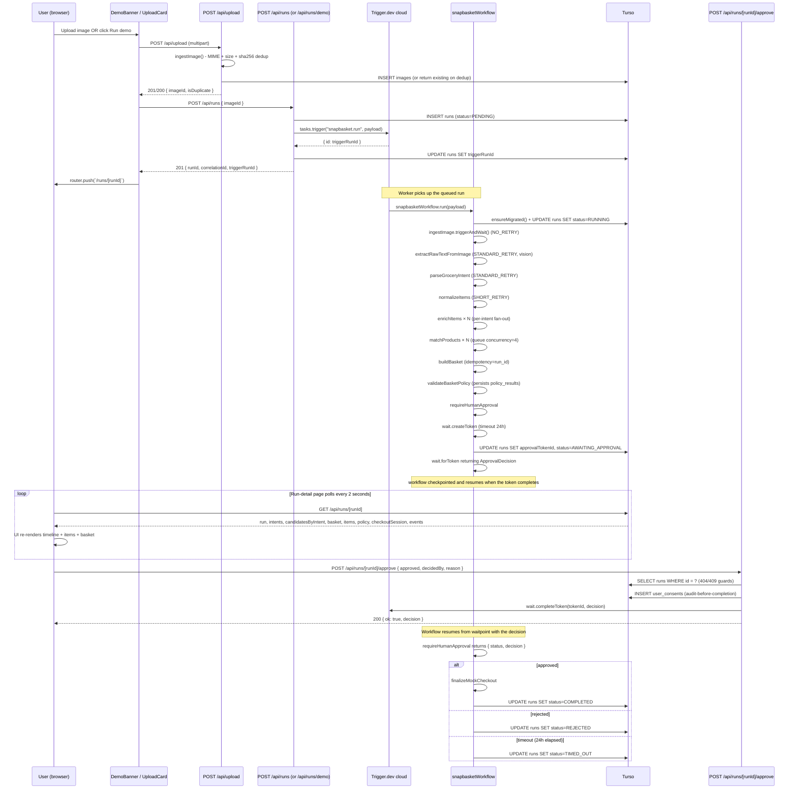

# SnapBasket - Technical Guide

---

## Table of Contents

1. [What the app does](#1-what-the-app-does)
2. [Two-runtime architecture](#2-two-runtime-architecture)
3. [Project structure](#3-project-structure)
4. [Full request flow (diagram)](#4-full-request-flow-diagram)
5. [Backend walkthrough](#5-backend-walkthrough)
   - 5.1 [Entry point - `app/layout.tsx`](#51-entry-point--applayouttsx)
   - 5.2 [Configuration - `lib/config/env.ts`](#52-configuration--libconfigenvts)
6. [Database layer](#6-database-layer)
   - 6.1 [Schema - `lib/db/schema.ts`](#61-schema--libdbschemats)
   - 6.2 [Client - `lib/db/client.ts`](#62-client--libdbclientts)
   - 6.3 [Standalone migrate - `lib/db/migrate.ts`](#63-standalone-migrate--libdbmigratets)
7. [API routes](#7-api-routes)
   - 7.1 [Health - `app/api/health/route.ts`](#71-health--appapihealthroutets)
   - 7.2 [Upload - `app/api/upload/route.ts`](#72-upload--appapiuploadroutets)
   - 7.3 [Images - `app/api/images/[imageId]/route.ts`](#73-images--appapiimagesimageidroutets)
   - 7.4 [Runs POST + GET - `app/api/runs`](#74-runs-post--get--appapiruns)
   - 7.5 [Demo - `app/api/runs/demo/route.ts`](#75-demo--appapirunsdemoroutets)
   - 7.6 [Approve - `app/api/runs/[runId]/approve/route.ts`](#76-approve--appapirunsrunidapproveroutets)
8. [Domain layer](#8-domain-layer)
9. [Parser - `lib/parser/`](#9-parser--libparser)
10. [Policy validator - `lib/policy/`](#10-policy-validator--libpolicy)
11. [Providers](#11-providers)
    - 11.1 [Vision provider - `lib/providers/vision/`](#111-vision-provider--libprovidersvision)
    - 11.2 [Commerce provider - `lib/providers/commerce/`](#112-commerce-provider--libproviderscommerce)
12. [Workflow tasks](#12-workflow-tasks)
    - 12.1 [Root workflow - `trigger/workflow.ts`](#121-root-workflow--triggerworkflowts)
    - 12.2 [ingestImage](#122-ingestimage)
    - 12.3 [extractRawTextFromImage](#123-extractrawtextfromimage)
    - 12.4 [parseGroceryIntent](#124-parsegroceryintent)
    - 12.5 [normalizeItems](#125-normalizeitems)
    - 12.6 [enrichItems](#126-enrichitems)
    - 12.7 [matchProducts (fan-out)](#127-matchproducts-fan-out)
    - 12.8 [buildBasket](#128-buildbasket)
    - 12.9 [validateBasketPolicy](#129-validatebasketpolicy)
    - 12.10 [requireHumanApproval (waitpoint)](#1210-requirehumanapproval-waitpoint)
    - 12.11 [finalizeMockCheckout](#1211-finalizemockcheckout)
13. [Server helpers - `lib/server/`](#13-server-helpers--libserver)
14. [Observability - `lib/observability/`](#14-observability--libobservability)
15. [Trigger.dev helpers - `lib/trigger/`](#15-triggerdev-helpers--libtrigger)
16. [Frontend walkthrough](#16-frontend-walkthrough)
17. [Docker and deployment](#17-docker-and-deployment)
18. [Testing strategy](#18-testing-strategy)
19. [Security model](#19-security-model)
20. [Key design decisions and trade-offs](#20-key-design-decisions-and-trade-offs)

---

## 1. What the app does

A user uploads a photo of a handwritten grocery list (or clicks "Run demo" to use a bundled list). The app:

1. Validates the upload (MIME, size) and writes the bytes to disk, deduplicating by sha256
2. Creates a database row to track the run
3. Triggers a durable workflow on Trigger.dev's cloud
4. The workflow:
   - **Extracts text** from the image via OpenAI GPT-4o (or a deterministic mock)
   - **Parses** each line into a structured intent (canonical name, quantity, unit, hedge phrases, compound splits)
   - **Normalizes** items (`tomatoes` → `tomato`, infers categories)
   - **Enriches** each intent (currently a no-op fan-out hook for future synonyms / brand expansion)
   - **Matches** every intent against an in-memory commerce catalog using a word-set Jaccard scorer with a 0.55 acceptance threshold
   - **Builds a basket** from the top-scoring candidate per intent, with deterministic idempotency
   - **Validates** the basket against policy rules (budget, allergens, dietary restrictions, low-confidence matches)
   - **Pauses durably** at a Trigger.dev waitpoint, awaiting human approval
5. The user sees the proposed basket on a live-polling run-detail page
6. The user clicks **Approve** or **Reject**
7. The API route persists the user's consent **before** completing the waitpoint (audit-before-completion)
8. The workflow resumes, finalises a mock checkout and the run reaches `COMPLETED`

Throughout, every task emits structured events into a `workflow_events` table that drives the live UI timeline.

When `OPENAI_API_KEY` is not set, the app runs in **demo / mock-vision mode** - the canonical 10-item mock transcription is used regardless of the input image. This is the default so reviewers can run the full workflow without any API costs.

---

## 2. Two-runtime architecture

The app intentionally splits between two runtimes that share state via a remote SQLite-compatible store (Turso):

```
┌────────────────────────────────────┐         ┌──────────────────────────────────┐
│  Cloud Run - web tier              │         │  Trigger.dev cloud - workers     │
│  • Next.js app (App Router)        │         │  • Bundled trigger/ tasks        │
│  • API routes (/api/*)             │ ──API──►│  • Owns retry budgets            │
│  • UploadCard, RunView, ...        │  call   │  • Owns durable waitpoints       │
│  • Calls tasks.trigger() to        │         │  • Owns queue + concurrency      │
│    enqueue workflow runs           │         │                                  │
└────────────────┬───────────────────┘         └──────────────┬───────────────────┘
                 │                                            │
                 │   libsql HTTP                              │   libsql HTTP
                 ▼                                            ▼
┌──────────────────────────────────────────────────────────────────────────────────┐
│  Turso (managed libsql)                                                          │
│  Both runtimes connect to the same DB                                            │
│  Schema: 11 tables (images, runs, intents, candidates, baskets, policy, ...)     │
└──────────────────────────────────────────────────────────────────────────────────┘
```

**Why this split?** The web tier is stateless and cheap to scale (Cloud Run scales to zero). The workflow tasks need a durable runtime that owns retries, waitpoints and queues - that's exactly what Trigger.dev v4 provides. Coupling the two would mean either:

- Self-hosting Trigger.dev workers next to the web app (heavy ops surface), or
- Running long-lived workflows in serverless functions (impossible - the human-approval waitpoint can take 24 hours)

By using Trigger.dev's cloud workers, the web tier stays thin and the workflow tier stays durable. Turso is the bridge - a remote SQLite endpoint that both runtimes can read and write concurrently.

**Why Turso (not Cloud SQL Postgres)?** The schema, every Drizzle query and every test was written assuming SQLite. Switching to Postgres would have required schema-type tweaks (timestamps, integers) and re-validating every query. Turso is API-compatible with libsql/SQLite - the only refactor needed was swapping `better-sqlite3` (sync) for `@libsql/client` (async), which was mechanical rather than schema-level.

---

## 3. Project structure

```
AI-grocery-agent-snapbasket/
├── app/                              Next.js App Router
│   ├── layout.tsx                    Root layout: fonts, banner, gradient mesh
│   ├── page.tsx                      Homepage (Hero + HowItWorks + WhyThisExists)
│   ├── globals.css                   Theme tokens, animations, utilities
│   ├── api/
│   │   ├── health/route.ts           GET /api/health
│   │   ├── upload/route.ts           POST /api/upload (multipart)
│   │   ├── images/[imageId]/route.ts GET /api/images/[imageId] (binary)
│   │   ├── runs/route.ts             POST /api/runs
│   │   ├── runs/demo/route.ts        POST /api/runs/demo
│   │   ├── runs/[runId]/route.ts     GET /api/runs/[runId]  (polled by UI)
│   │   └── runs/[runId]/approve/route.ts   POST /api/runs/[runId]/approve
│   └── runs/[runId]/                 Run-detail page
│       ├── page.tsx                  Server component (async params)
│       └── run-view.tsx              Client component with usePollRun
├── components/
│   ├── Hero.tsx                      Homepage hero with eyebrow + h1 + body + CTAs
│   ├── HowItWorks.tsx                3-card "Snap → Match → Approve" overview
│   ├── WhyThisExists.tsx             Long-form "the interesting layer" copy
│   ├── DemoBanner.tsx                Sticky "Demo mode" pill at top
│   ├── UploadCard.tsx                Drag-drop + file picker (client component)
│   ├── RunDemoButton.tsx             Demo CTA (POSTs /api/runs/demo)
│   ├── RunImagePreview.tsx           Source image preview on /runs/[runId]
│   ├── RunProgress.tsx               Fan-out-aware progress bar
│   ├── WorkflowTimeline.tsx          Aggregated event timeline with accordions
│   ├── StatusBadge.tsx               Pulsing run-status badge
│   ├── IntentList.tsx                Per-intent rows with matched product
│   ├── BasketReview.tsx              Proposed basket + policy flags
│   ├── PolicyFlagList.tsx            Coloured pills per flag kind
│   ├── ApprovalCard.tsx              Awaiting-approval form
│   ├── ReceiptCard.tsx               Mock checkout receipt
│   └── ui/                           shadcn primitives (Button, Card, ...)
├── lib/
│   ├── config/env.ts                 Zod-validated env (fail-fast)
│   ├── db/
│   │   ├── schema.ts                 11 tables + 4 enum tuples
│   │   ├── client.ts                 getDb() + ensureMigrated() (libsql + drizzle)
│   │   ├── migrate.ts                Standalone migration script (used by db:migrate)
│   │   └── index.ts                  Re-exports
│   ├── domain/
│   │   ├── schemas.ts                Zod schemas (PolicyFlag union, etc.)
│   │   └── types.ts                  Inferred + manual TypeScript types
│   ├── parser/
│   │   ├── intent.ts                 parseGroceryLine + parseGroceryText (compound split)
│   │   ├── normalize.ts              CANONICAL_NAMES + inferCategory + CATEGORY_RULES
│   │   └── types.ts                  ParsedGroceryIntent
│   ├── policy/
│   │   ├── validate.ts               validateBasket(ctx) → BasketPolicyResult
│   │   ├── user-profile.ts           UserProfile (allergens, dietary, maxBudgetPence)
│   │   └── index.ts
│   ├── providers/
│   │   ├── vision/
│   │   │   ├── types.ts              VisionProvider interface
│   │   │   ├── mock.ts               MockVisionProvider (deterministic)
│   │   │   ├── openai.ts             OpenAiVisionProvider (GPT-4o)
│   │   │   └── index.ts              Provider selector at module load
│   │   └── commerce/
│   │       ├── types.ts              CommerceProvider interface
│   │       ├── mock-ucp.ts           MockUcpCommerceProvider (search/basket/checkout)
│   │       ├── catalog.json          ~89 catalog items
│   │       └── index.ts              commerceProvider singleton
│   ├── server/
│   │   ├── api.ts                    NextResponse helpers (badRequest, notFound, ...)
│   │   ├── upload.ts                 ingestImage() (validation + sha256 dedup)
│   │   └── workflow-trigger.ts       triggerSnapbasketRun() wrapper
│   ├── observability/
│   │   ├── logger.ts                 Structured JSON logger
│   │   ├── correlation.ts            newCorrelationId / withCorrelationId
│   │   ├── events.ts                 emitWorkflowEvent() (writes to workflow_events)
│   │   └── otel.ts                   withSpan() wrapper for OpenTelemetry
│   ├── trigger/
│   │   ├── retry.ts                  STANDARD_RETRY / SHORT_RETRY / NO_RETRY
│   │   └── fault-injection.ts        maybeInjectFault() (MOCK_FAULT_RATE proof)
│   ├── ui/
│   │   ├── format.ts                 formatPence, formatDuration
│   │   ├── status-color.ts           Per-status Tailwind classes
│   │   └── use-poll-run.ts           Run-detail polling hook
│   └── utils.ts                      cn() helper for Tailwind class merging
├── trigger/                          Trigger.dev tasks (FLAT layout - only registered tasks)
│   ├── workflow.ts                   snapbasketWorkflow root task
│   ├── ingestImage.ts                Bookkeeping (sha256 already done by /api/upload)
│   ├── extractRawTextFromImage.ts    visionProvider.extract(...) - STANDARD_RETRY
│   ├── parseGroceryIntent.ts         parseGroceryText() over the raw transcription
│   ├── normalizeItems.ts             Canonical-name + category inference
│   ├── enrichItems.ts                Per-intent fan-out (no-op, future hook)
│   ├── matchProducts.ts              Per-intent fan-out + queue concurrency=4
│   ├── buildBasket.ts                Picks selected candidates → commerceProvider.createBasket
│   ├── validateBasketPolicy.ts       validator + persists policy_results
│   ├── requireHumanApproval.ts       wait.createToken + wait.forToken<Decision>
│   └── finalizeMockCheckout.ts       commerceProvider.createCheckoutSession
├── drizzle/                          Migration files
│   └── meta/_journal.json
├── public/demo/grocery-note-sample.png    Bundled handwritten grocery list
├── tests/                            Vitest test suite (95 tests / 16 files)
│   ├── unit/                         Pure-function tests (parser, policy, env, scoring)
│   ├── integration/                  Route handler + workflow integration tests
│   ├── __mocks__/server-only.ts      Vitest alias for "server-only" package
├── .github/workflows/ci.yml          GitHub Actions CI
├── trigger.config.ts                 Trigger.dev project + build extensions
├── next.config.ts                    output: 'standalone'
├── pnpm-workspace.yaml               supportedArchitectures (linux x64 cross-deploy)
├── Dockerfile                        Multi-stage build (deps → build → runtime)
└── .dockerignore                     Excludes data/, tests/, _private docs, .env*
```

**Why this layout?** Each directory has one clear job:

- `app/` is HTTP boundary code (Next.js routes, page components)
- `lib/` is pure logic with no HTTP awareness (parsers, policy validator, providers)
- `trigger/` is workflow tasks - one file per task, all registered with Trigger.dev's runtime
- `components/` is UI - presentation only, no business logic

A workflow task never imports from `app/`. A `lib/policy` validator never imports from `lib/db` (it gets data via its `PolicyContext` argument). This makes each module independently testable.

---

## 4. Full request flow (diagram)



---

## 5. Backend walkthrough

### 5.1 Entry point - `app/layout.tsx`

**File:** `app/layout.tsx`

The Next.js root layout. Loads two Google Fonts and wires the global chrome:

```tsx
import { Inter, JetBrains_Mono } from "next/font/google";
import { DemoBanner } from "@/components/DemoBanner";
import "./globals.css";

const inter = Inter({ subsets: ["latin"], variable: "--font-sans", display: "swap" });
const mono = JetBrains_Mono({ subsets: ["latin"], variable: "--font-serif", display: "swap" });

export default function RootLayout({ children }) {
  return (
    <html lang="en" className={`${inter.variable} ${mono.variable} h-full antialiased`}>
      <body className="bg-background text-foreground relative flex min-h-full flex-col font-sans">
        <DemoBanner />
        <div className="bg-mesh pointer-events-none fixed inset-0 -z-10" />
        <div className="bg-grid pointer-events-none fixed inset-0 -z-10 opacity-50" />
        {children}
      </body>
    </html>
  );
}
```

The `bg-mesh` and `bg-grid` divs are fixed-positioned, behind everything (`-z-10`) and pointer-event-none. They're CSS-only ambient effects defined in `globals.css` - a multi-radial-gradient mesh in mint/coral/cyan and a subtle dot pattern.

The `--font-sans` (Inter) and `--font-serif` (JetBrains Mono) CSS variables are set on `<html>` so Tailwind's `font-sans` and `font-mono` classes resolve to them via the `@theme inline` declaration in `globals.css`.

### 5.2 Configuration - `lib/config/env.ts`

**File:** `lib/config/env.ts`

Every env var the app reads is declared in a single Zod schema. Zod parses `process.env` once at module load and throws a readable error if anything is malformed - the server refuses to start rather than failing later with a confusing `undefined`:

```ts
const EnvSchema = z.object({
  DATABASE_URL: z.string().min(1).optional(),
  TRIGGER_PROJECT_REF: z.string().min(1).optional(),
  TRIGGER_API_KEY: z.string().min(1).optional(),
  TRIGGER_SECRET_KEY: z.string().min(1).optional(),
  OPENAI_API_KEY: z.string().regex(/^sk-/, "OPENAI_API_KEY must start with 'sk-'").optional(),
  OPENAI_MODEL: z.string().default("gpt-4o"),
  MOCK_FAULT_RATE: z.coerce.number().min(0).max(1).default(0),
  NODE_ENV: z.enum(["development", "test", "production"]).default("development"),
});

export const env: Env = parseEnv(); // throws on bad shape
```

**Why every field is optional:** the app is designed to run without any external service. With no `OPENAI_API_KEY`, the vision provider falls back to the deterministic mock. With no `TRIGGER_*` vars, the workflow trigger calls fail at runtime - but the rest of the app boots and can be inspected. This keeps local dev frictionless and lets reviewers exercise the UI without setting up accounts.

**Why the OpenAI regex:** if a user pastes a malformed key (e.g., extra whitespace, wrong prefix), the validator catches it immediately rather than at the first OpenAI request - much easier to debug.

**Why `z.coerce.number()` for `MOCK_FAULT_RATE`:** env vars are strings, but downstream code expects a number. `coerce.number()` runs `Number(...)` first then validates with `min(0).max(1)`, so `MOCK_FAULT_RATE=1.0` works.

`TURSO_DATABASE_URL` and `TURSO_AUTH_TOKEN` are read directly from `process.env` in `lib/db/client.ts` rather than going through this schema - they're consumed by the libsql client only and don't need the same fail-fast treatment.

---

## 6. Database layer

### 6.1 Schema - `lib/db/schema.ts`

**File:** `lib/db/schema.ts`

Eleven tables drive every state in the app:

| Table                | Purpose                                                                                                                                                                       |
| -------------------- | ----------------------------------------------------------------------------------------------------------------------------------------------------------------------------- |
| `images`             | Uploaded image bytes (sha256 unique). The payload bytes are inlined into the workflow trigger; this row is the metadata.                                                      |
| `runs`               | One per workflow execution. Status lifecycle: `PENDING → RUNNING → AWAITING_APPROVAL → COMPLETED / REJECTED / TIMED_OUT / FAILED`. Holds `approvalTokenId` for the waitpoint. |
| `raw_extractions`    | Raw OCR transcription per run. Decoupled from the run row so re-running the workflow can update it.                                                                           |
| `product_intents`    | One row per parsed grocery item (after compound splitting).                                                                                                                   |
| `product_candidates` | Top N matches per intent from the commerce catalog, with `score` and `isSelected`.                                                                                            |
| `baskets`            | One per run (`runId` is unique). Holds totals + provider basket id + idempotency key.                                                                                         |
| `basket_items`       | Line items for a basket.                                                                                                                                                      |
| `policy_results`     | Output of `validateBasket()`: flags, requiresExplicitApproval, totalCostPence.                                                                                                |
| `checkout_sessions`  | One per basket (created after approval). Holds `providerSessionId`, `consentJson`, `status`.                                                                                  |
| `workflow_events`    | Append-only event stream for the UI timeline. Started/succeeded/failed/retrying per task per attempt.                                                                         |
| `user_consents`      | Audit trail for approve/reject decisions. Persisted **before** the waitpoint completes.                                                                                       |

The status enums are TypeScript tuples (`as const`) so Drizzle's `text("status", { enum: RUN_STATUSES })` gives both DB-level constraint and TS-level type narrowing:

```ts
export const RUN_STATUSES = [
  "PENDING",
  "RUNNING",
  "AWAITING_APPROVAL",
  "APPROVED",
  "REJECTED",
  "TIMED_OUT",
  "COMPLETED",
  "FAILED",
] as const;
```

**Notable constraints:**

- `images.sha256` - unique. Same content always produces the same imageId.
- `runs.idempotencyKey` (on `baskets`) - unique. Workflow retries of `buildBasket` return the same basket.
- `baskets.runId` - unique. One basket per run.
- Foreign keys throughout (`product_intents.runId → runs.id`, etc.) with `ON DELETE` left implicit at the SQLite level.

### 6.2 Client - `lib/db/client.ts`

**File:** `lib/db/client.ts`

Lazy-singleton libsql client + drizzle wrapper:

```ts
import { createClient, type Client } from "@libsql/client";
import { drizzle } from "drizzle-orm/libsql";
import { migrate } from "drizzle-orm/libsql/migrator";

const DEFAULT_DB_PATH = path.resolve(process.cwd(), "data/snapbasket.db");

let _client: Client | undefined;
let _db: ReturnType<typeof drizzle<typeof schema>> | undefined;
let _migrated = false;

export function getDb() {
  if (!_db) {
    const tursoUrl = process.env.TURSO_DATABASE_URL;
    const localUrl = process.env.DATABASE_URL ?? DEFAULT_DB_PATH;
    const isRemote = Boolean(tursoUrl);
    const url = isRemote ? tursoUrl! : `file:${localUrl}`;
    const authToken = isRemote ? process.env.TURSO_AUTH_TOKEN : undefined;

    if (!isRemote) {
      mkdirSync(path.dirname(localUrl), { recursive: true });
    }

    _client = createClient({ url, ...(authToken ? { authToken } : {}) });
    _db = drizzle(_client, { schema });
  }
  return _db;
}

export async function ensureMigrated() {
  if (_migrated) return;
  const db = getDb();
  await migrate(db, { migrationsFolder: path.resolve(process.cwd(), "drizzle") });
  _migrated = true;
}
```

**Three-tier URL precedence:**

| Priority | Source                               | When it's used                                                     |
| -------- | ------------------------------------ | ------------------------------------------------------------------ |
| 1        | `TURSO_DATABASE_URL` (libsql://...)  | Production - both Cloud Run and Trigger.dev workers connect remote |
| 2        | `DATABASE_URL` (file path)           | Tests with explicit DB paths                                       |
| 3        | `data/snapbasket.db` (local default) | Local dev                                                          |

**Why two functions (`getDb` + `ensureMigrated`)?** drizzle's query-builder calls (`.select().from(t).where(c)`) are sync and chain into a terminal `.all()` / `.get()` / `.run()` that's async. So `getDb()` itself stays sync - it returns the drizzle instance, callers add `await` only on the terminal call. Migrations are inherently async (libsql uses HTTP for remote) so `ensureMigrated()` is its own async function. Callers `await ensureMigrated()` once at the top of every API route handler and trigger task `run` body.

**Why `_migrated` is a flag and not in the DB?** Drizzle internally tracks applied migrations in a `__drizzle_migrations` table. The `_migrated` JS-level flag is just an optimisation - skip the round-trip after the first call within a single process. On a new container / cold start, `_migrated` is false again and we re-check. Idempotent - drizzle won't re-apply migrations that are already in `__drizzle_migrations`.

**Why `closeDb()` is sync** - libsql's `client.close()` returns void. Used in test teardown.

### 6.3 Standalone migrate - `lib/db/migrate.ts`

**File:** `lib/db/migrate.ts`

Used by `pnpm db:migrate` (= `tsx lib/db/migrate.ts`) for explicit local-dev migrations:

```ts
async function main() {
  const client = createClient({ url, ...(authToken ? { authToken } : {}) });
  const db = drizzle(client, { schema });
  await migrate(db, { migrationsFolder });
  console.log(`Migrations applied to ${url}`);
  client.close();
}

main().catch((err) => {
  console.error(err);
  process.exit(1);
});
```

Different from `ensureMigrated()` because it's a one-shot CLI script, not a runtime helper. It opens its own client, applies migrations, closes the client and exits.

---

## 7. API routes

### 7.1 Health - `app/api/health/route.ts`

```ts
export const dynamic = "force-dynamic";

export function GET() {
  return NextResponse.json({
    ok: true,
    service: "snapbasket",
    ts: new Date().toISOString(),
  });
}
```

Trivial - returns 200 immediately. Used by Cloud Run's startup probe and as the basic "is the deployed service alive" smoke target.

### 7.2 Upload - `app/api/upload/route.ts`

**File:** `app/api/upload/route.ts`

Accepts a multipart `file` field, runs it through `ingestImage()`, returns the upload result:

```ts
export async function POST(request: NextRequest) {
  let formData: FormData;
  try {
    formData = await request.formData();
  } catch {
    return badRequest("Expected multipart/form-data body");
  }

  const file = formData.get("file");
  if (!(file instanceof File)) return badRequest("Missing file field (form key 'file')");

  const bytes = new Uint8Array(await file.arrayBuffer());

  try {
    const result = await ingestImage({ bytes, mime: file.type });
    return NextResponse.json(result, { status: result.isDuplicate ? 200 : 201 });
  } catch (err) {
    if (err instanceof UploadError) return badRequest(err.message, { code: err.code });
    return internalError("Upload failed");
  }
}
```

**Status codes:**

- `201 Created` - new image (sha256 not seen before)
- `200 OK` - duplicate (returned with the existing imageId)
- `400 Bad Request` - validation failure (`UploadError`)

**Why the response status differs:** REST convention. `201` signals "a new resource was created"; `200` signals "successful but no new resource". The client (UploadCard) doesn't currently distinguish - it just reads the `imageId` from the body.

### 7.3 Images - `app/api/images/[imageId]/route.ts`

Streams an uploaded image's bytes back to the browser for preview on the run-detail page:

```ts
export async function GET(_request: NextRequest, { params }: RouteContext) {
  const { imageId } = await params;
  await ensureMigrated();
  const db = getDb();
  const row = (await db.select().from(images).where(eq(images.id, imageId)).all())[0];
  if (!row) return notFound(`Image ${imageId} not found`);

  let bytes: Buffer;
  try {
    bytes = await readFile(row.storagePath);
  } catch {
    return internalError("Image file missing on disk");
  }

  return new NextResponse(new Uint8Array(bytes), {
    status: 200,
    headers: {
      "Content-Type": row.mime,
      "Content-Length": String(bytes.byteLength),
      "Cache-Control": "private, max-age=31536000, immutable",
    },
  });
}
```

**Cache-Control: immutable** - the imageId is sha256-derived, so the bytes for a given id never change. The browser can cache for a year safely. This means the source-image preview on the run-detail page loads instantly on subsequent views.

### 7.4 Runs POST + GET - `app/api/runs`

**POST** - starts a workflow run for an existing imageId:

```ts
const StartRunSchema = z.object({ imageId: z.string().min(1) });

export async function POST(request: NextRequest) {
  // ... parse + validate body ...

  await ensureMigrated();
  const db = getDb();
  const image = (await db.select().from(images).where(eq(images.id, parsed.data.imageId)).all())[0];
  if (!image) return notFound(`Image ${parsed.data.imageId} not found`);

  const runId = `run_${randomUUID()}`;
  const correlationId = newCorrelationId();
  const userId = "user_default";

  await db
    .insert(runs)
    .values({
      id: runId,
      imageId: parsed.data.imageId,
      userId,
      correlationId,
      status: "PENDING",
    })
    .run();

  const imageBytes = new Uint8Array(readFileSync(image.storagePath));

  const { triggerRunId } = await triggerSnapbasketRun({
    runId,
    correlationId,
    imageId: image.id,
    sha256: image.sha256,
    imageBytes,
    mime: image.mime,
  });

  await db.update(runs).set({ triggerRunId }).where(eq(runs.id, runId)).run();

  return NextResponse.json({ runId, correlationId, triggerRunId }, { status: 201 });
}
```

**Why bytes are read here, not just the imageId:** Trigger.dev workflow tasks need the image bytes to call the vision provider. The workers don't have access to the web tier's filesystem (different machines), so the bytes are passed as part of the task payload. SQLite-backed image rows store the storagePath; this route reads from disk into the payload.

**`user_default` is a placeholder.** There is no real auth in this app. Adding auth would gate this route and replace `user_default` with the authenticated user's id.

**GET** - aggregate snapshot for the run-detail page polling:

```ts
export async function GET(_request: NextRequest, { params }: RouteContext) {
  const { runId } = await params;
  await ensureMigrated();
  const db = getDb();

  const run = (await db.select().from(runs).where(eq(runs.id, runId)).all())[0];
  if (!run) return notFound(`Run ${runId} not found`);

  const intents = await db.select().from(productIntents).where(eq(productIntents.runId, runId)).all();
  const candidatesByIntent: Record<string, unknown[]> = {};
  for (const intent of intents) {
    candidatesByIntent[intent.id] = await db.select()...where(eq(productCandidates.intentId, intent.id)).all();
  }

  const basket = (await db.select().from(baskets).where(eq(baskets.runId, runId)).all())[0] ?? null;
  const items = basket ? await db.select().from(basketItems).where(eq(basketItems.basketId, basket.id)).all() : [];
  const policy = basket ? (await db.select().from(policyResults).where(eq(policyResults.basketId, basket.id)).all())[0] ?? null : null;
  const checkoutSession = basket ? (await db.select().from(checkoutSessions).where(eq(checkoutSessions.basketId, basket.id)).all())[0] ?? null : null;
  const events = await db.select().from(workflowEvents).where(eq(workflowEvents.runId, runId)).all();

  return NextResponse.json({ run, intents, candidatesByIntent, basket, items, policy, checkoutSession, events });
}
```

**Why a single fat aggregate response?** The polling client needs a consistent snapshot of the run state. Splitting into 6 separate endpoints would create races (UI shows a basket but the policy result hasn't loaded yet, etc.). One round-trip per poll is cleaner.

**Read amplification on fan-out:** the `for (intent of intents)` loop fetches candidates for each intent. With 22 intents, that's 22 SELECTs per poll. For larger workflows you'd batch this with `inArray()` - here it's left as a per-intent loop for clarity.

### 7.5 Demo - `app/api/runs/demo/route.ts`

Same flow as `POST /api/runs` but reads the bundled `public/demo/grocery-note-sample.png` instead of an uploaded image:

```ts
const DEMO_IMAGE_PATH = path.resolve(process.cwd(), "public/demo/grocery-note-sample.png");

export async function POST() {
  const bytes = new Uint8Array(readFileSync(DEMO_IMAGE_PATH));
  const upload = await ingestImage({ bytes, mime: "image/png" });

  // ... same INSERT runs + triggerSnapbasketRun + UPDATE runs ...
}
```

**No request body needed** - the bundled image is the input. Reviewers click "Run demo" with no file upload step.

### 7.6 Approve - `app/api/runs/[runId]/approve/route.ts`

The waitpoint completion endpoint. Most security-sensitive route in the app - it triggers workflow resumption based on a user decision. **Critical: persist the consent BEFORE completing the token**, so an audit trail exists even if the SDK call fails after partial work:

```ts
const ApproveSchema = z.object({
  approved: z.boolean(),
  decidedBy: z.string().min(1),
  reason: z.string().nullable(),
});

export async function POST(request: NextRequest, { params }: RouteContext) {
  const { runId } = await params;
  // ... parse + validate body (400 on shape failure) ...

  const run = (await db.select().from(runs).where(eq(runs.id, runId)).all())[0];
  if (!run) return notFound(`Run ${runId} not found`);
  if (run.status !== "AWAITING_APPROVAL") {
    return conflict(`Run ${runId} is not awaiting approval (current status: ${run.status})`);
  }
  if (!run.approvalTokenId) {
    return internalError(`Run ${runId} has no approvalTokenId despite AWAITING_APPROVAL status`);
  }

  const decision = {
    approved: parsed.data.approved,
    decidedBy: parsed.data.decidedBy,
    reason: parsed.data.reason,
    decidedAt: new Date().toISOString(),
  };

  // Persist consent BEFORE completing the token
  await db
    .insert(userConsents)
    .values({
      id: `con_${randomUUID()}`,
      runId,
      decidedBy: parsed.data.decidedBy,
      approved: parsed.data.approved,
      reason: parsed.data.reason,
    })
    .run();

  try {
    await wait.completeToken(run.approvalTokenId, decision);
    return NextResponse.json({ ok: true, decision });
  } catch (err) {
    return internalError("Failed to complete waitpoint token");
  }
}
```

**The four guards (in order):**

1. **400** - body fails Zod validation
2. **404** - run id doesn't exist
3. **409** - run is not in `AWAITING_APPROVAL` status (already decided, or hasn't reached the waitpoint yet)
4. **500** - run is in the right state but has no `approvalTokenId` (bug - shouldn't happen, but we surface it)

The 4-test integration suite for this route covers all four paths.

---

## 8. Domain layer

**Files:** `lib/domain/schemas.ts`, `lib/domain/types.ts`

The single source of truth for cross-cutting types. Examples:

```ts
// PolicyFlag is a discriminated union - 6 different shapes, all sharing the kind discriminator
const BudgetExceededFlag = z.object({
  kind: z.literal("BUDGET_EXCEEDED"),
  maxPence: z.number().int().nonnegative(),
  actualPence: z.number().int().nonnegative(),
});

const AllergenDetectedFlag = z.object({
  kind: z.literal("ALLERGEN_DETECTED"),
  itemId: z.string(),
  allergen: z.string(),
});

// ... and 4 more flag shapes ...

export const PolicyFlagSchema = z.discriminatedUnion("kind", [
  BudgetExceededFlag,
  AllergenDetectedFlag,
  DietaryViolationFlag,
  LowConfidenceMatchFlag,
  UnavailableProductFlag,
  SubstitutionAppliedFlag,
]);
```

**Why a discriminated union (not a flat type)?** Each flag kind has different fields - a budget flag has `maxPence/actualPence`, an allergen flag has `itemId/allergen`. With a discriminated union, TypeScript narrows on `flag.kind === "BUDGET_EXCEEDED"` and gives you exactly the right fields. The validator and the UI both rely on this.

**Why Zod and TS types together?** The Zod schema validates **runtime** inputs (e.g., parsing `flagsJson` from the DB). The inferred TS types give **compile-time** safety for everything else. They're kept in sync via `z.infer<typeof PolicyFlagSchema>`.

---

## 9. Parser - `lib/parser/`

**Files:** `lib/parser/intent.ts`, `lib/parser/normalize.ts`

The parser converts raw OCR text into structured intents. It's pure - no I/O, no DB.

### `parseGroceryLine(line)` - one line → one intent (or null)

```ts
export function parseGroceryLine(line: string): ParsedGroceryIntent | null {
  const trimmed = line.trim();
  if (trimmed.length === 0) return null;

  let workingText = trimmed;
  let quantity = 1;
  let unit = "item";

  // 1. Detect hedge ("maybe", "if needed", trailing "?") - strip and flag
  const hedgeMatch = workingText.match(HEDGE_PATTERN);
  let needsClarification = false;
  if (hedgeMatch) {
    needsClarification = true;
    workingText = workingText.replace(HEDGE_PATTERN, "").trim();
  }

  // 2. Quantity-with-unit ("3kg flour", "2L milk") OR trailing "x2"
  const qtyUnitMatch = workingText.match(QTY_UNIT_PATTERN);
  if (qtyUnitMatch?.[1] && qtyUnitMatch?.[2]) {
    quantity = parseFloat(qtyUnitMatch[1]);
    unit = qtyUnitMatch[2].toLowerCase();
    workingText = workingText.replace(QTY_UNIT_PATTERN, "").trim();
    workingText = workingText.replace(LEADING_PREPOSITION, "").trim();  // strip "of"
  } else {
    const trailingMatch = workingText.match(TRAILING_QTY_PATTERN);
    if (trailingMatch?.[1]) {
      quantity = parseFloat(trailingMatch[1]);
      workingText = workingText.replace(TRAILING_QTY_PATTERN, "").trim();
    }
  }

  const canonicalName = normalizeName(workingText);
  const category = inferCategory(canonicalName);
  return { originalText: trimmed, canonicalName, quantity, unit, category, ... };
}
```

### `parseGroceryText(rawText)` - multi-line OCR → many intents

Splits on newlines, then on compound separators (`+` and `&`). Distributes a shared trailing noun across **color-qualifier** fragments only:

```ts
// "red + green pepper" → ["red pepper", "green pepper"]   (color qualifiers borrow noun)
// "yellow mustard + honey" → ["yellow mustard", "honey"]  (honey is a noun, NOT a qualifier)
const COLOR_QUALIFIERS = new Set([
  "red", "green", "blue", "yellow", "white", "black", "brown", "orange", "purple", "pink",
]);

function splitCompound(line: string): string[] {
  const parts = line.split(COMPOUND_SEPARATOR).map(s => s.trim()).filter(Boolean);
  if (parts.length < 2) return parts;

  // Find the last word of the LAST multi-word fragment - that's the candidate noun
  let trailingNoun: string | null = null;
  for (let i = parts.length - 1; i >= 0; i--) {
    const words = parts[i]!.split(/\s+/);
    if (words.length >= 2) { trailingNoun = words[words.length - 1] ?? null; break; }
  }
  if (trailingNoun === null) return parts;

  return parts.map((part) => {
    const trimmed = part.toLowerCase().trim();
    if (COLOR_QUALIFIERS.has(trimmed)) return `${part} ${trailingNoun}`;
    return part;
  });
}

export function parseGroceryText(rawText: string): ParsedGroceryIntent[] {
  return rawText.split("\n").flatMap(splitCompound).map(parseGroceryLine).filter(...);
}
```

**Why color qualifiers specifically?** "Red + green pepper" almost always means "red pepper + green pepper" (distributive coordination). "Yellow mustard + honey" almost always means two distinct items. The discriminator: a color-only fragment is implausible as a standalone item, so it borrows the noun. Other qualifiers (`fresh`, `dried`, `light`) could be added if real grocery lists need them.

**Why slashes are NOT in `COMPOUND_SEPARATOR`:** "chicken thighs/breast" usually means "either of these is fine" - one product. "+" and "&" mean "and another item" - two products.

### `normalize.ts` - canonical names + category inference

```ts
const CANONICAL_NAMES: Record<string, string> = {
  yoghurt: "yogurt", // British spelling
  "greek yoghurt": "greek yogurt",
  tomatoes: "tomato", // singular form
  bananas: "banana",
  // ...
};

const CATEGORY_RULES: Array<{ pattern: RegExp; category: ProductCategory }> = [
  { pattern: /\bice cream\b/i, category: "frozen" },
  { pattern: /\b(milk|cheese|yog[h]?urt|butter|cream|...)\b/i, category: "dairy" },
  { pattern: /\b(banana|tomato|apple|onion|carrot|...)\b/i, category: "produce" },
  // ...
];
```

**Why a regex list and not an LLM?** Categories are stable and rule-based. Regexes are deterministic, fast and don't cost money. They handle 95% of cases correctly; the long tail goes to `category: "other"` which the matcher handles fine.

**Note:** the parser's inferred category was historically passed to `searchProducts` as a filter, but that turned out to be too restrictive (e.g., `tomato paste` infers `produce` because of `tomato`, but the matching product lives in `pantry`). The category filter was removed from `matchProducts.ts` and the word-set scorer alone handles cross-category matching.

---

## 10. Policy validator - `lib/policy/`

**Files:** `lib/policy/validate.ts`, `lib/policy/user-profile.ts`

Pure function. Takes a basket, candidates and a user profile, returns flags:

```ts
const LOW_CONFIDENCE_THRESHOLD = 0.6;

export function validateBasket(ctx: PolicyContext): BasketPolicyResult {
  const flags: PolicyFlag[] = [];

  // BUDGET
  if (ctx.basket.totalPence > ctx.profile.maxBudgetPence) {
    flags.push({ kind: "BUDGET_EXCEEDED", maxPence: ..., actualPence: ... });
  }

  for (const item of ctx.basket.items) {
    const candidate = ctx.candidates.get(item.candidateId);
    if (!candidate) continue;

    // LOW_CONFIDENCE_MATCH
    if (candidate.score < LOW_CONFIDENCE_THRESHOLD) {
      flags.push({ kind: "LOW_CONFIDENCE_MATCH", itemId: item.id, confidence: candidate.score, threshold: 0.6 });
    }

    // ALLERGEN
    for (const allergen of ctx.profile.allergens) {
      if (candidate.name.toLowerCase().includes(allergen.toLowerCase())) {
        flags.push({ kind: "ALLERGEN_DETECTED", itemId: item.id, allergen });
      }
    }

    // DIETARY (vegan / vegetarian / gluten-free / halal)
    for (const rule of ctx.profile.dietary) {
      if (containsDietaryViolation(candidate.name, rule)) {
        flags.push({ kind: "DIETARY_VIOLATION", itemId: item.id, rule });
      }
    }
  }

  return {
    ok: flags.length === 0,
    totalCostPence: ctx.basket.totalPence,
    flags,
    requiresExplicitApproval: flags.length > 0,
  };
}
```

The dietary rule lists are inline maps (`VEGETARIAN_FORBIDDEN`, `VEGAN_FORBIDDEN`, `GLUTEN_FORBIDDEN`, `HALAL_FORBIDDEN`) of substrings to check against candidate names. Coarse - "chicken pasta" would correctly flag for vegetarian but might also false-positive on a product called "vegan chicken alternative". For a portfolio demo this is fine; production would need an ontology.

**Why `requiresExplicitApproval = flags.length > 0` (any flag)?** The approval card behaviour distinguishes "no flags - just confirm" vs "flags worth a closer look - please review carefully". Even a single low-confidence match triggers the careful path - the user should glance at what the matcher chose.

---

## 11. Providers

### 11.1 Vision provider - `lib/providers/vision/`

**Files:** `lib/providers/vision/{types,mock,openai,index}.ts`

Abstraction so the workflow doesn't care whether real OpenAI or a deterministic mock is in play:

```ts
export interface VisionProvider {
  readonly name: string;
  extract(input: { imageBytes: Uint8Array; mime: string }): Promise<VisionExtractionResult>;
}
```

`MockVisionProvider` returns a canned 10-item transcription regardless of input - the same string every time. Used for tests and as the no-API-key default.

`OpenAiVisionProvider` calls GPT-4o with a prescriptive prompt:

```ts
async extract(input): Promise<VisionExtractionResult> {
  const dataUrl = `data:${input.mime};base64,${Buffer.from(input.imageBytes).toString("base64")}`;
  const completion = await this.client.chat.completions.create({
    model: this.model,
    max_tokens: 1024,
    messages: [
      {
        role: "user",
        content: [
          { type: "text", text: TRANSCRIPTION_PROMPT },
          { type: "image_url", image_url: { url: dataUrl } },
        ],
      },
    ],
  });
  return { rawText: completion.choices[0]?.message.content ?? "", confidence: 0.9 };
}
```

`TRANSCRIPTION_PROMPT` instructs the model to output one item per line, preserve quantities, ignore decorative elements - tuned for handwritten grocery lists specifically.

**Provider selection at module load:**

```ts
function selectProvider(): VisionProvider {
  if (env.OPENAI_API_KEY) {
    return new OpenAiVisionProvider({ apiKey: env.OPENAI_API_KEY, model: env.OPENAI_MODEL });
  }
  return new MockVisionProvider();
}

export const visionProvider: VisionProvider = selectProvider();

logger.info("vision provider selected", {
  provider: visionProvider.name,
  model: env.OPENAI_API_KEY ? env.OPENAI_MODEL : null,
});
```

**Why select once at module load (not per request)?** The provider is stateless after construction. Selecting once avoids re-reading env on every workflow run. The startup log line confirms which provider is active - useful for debugging the "I added an OpenAI key but tasks are still mock" scenario where the env var didn't propagate.

### 11.2 Commerce provider - `lib/providers/commerce/`

**Files:** `lib/providers/commerce/{types,mock-ucp,catalog.json,index}.ts`

UCP-inspired interface (Universal Commerce Platform pattern - search, basket, checkout, order status):

```ts
export interface CommerceProvider {
  readonly name: string;
  searchProducts(q: ProductQuery): Promise<ProductMatch[]>;
  createBasket(input: CreateBasketInput): Promise<Basket>;
  updateBasket(input: never): Promise<Basket>; // not implemented
  createCheckoutSession(input: CreateCheckoutSessionInput): Promise<CheckoutSession>;
  getOrderStatus(sessionId: string): Promise<OrderStatus>;
}
```

`MockUcpCommerceProvider` is the only implementation. It reads from `catalog.json` (~89 items) and uses a word-set Jaccard scorer:

```ts
const MIN_ACCEPTANCE = 0.55;

function tokenScore(query: string, tokens: readonly string[]): number {
  const q = query.trim().toLowerCase();
  if (q.length === 0) return 0;
  const queryWords = wordSet(q);
  if (queryWords.size === 0) return 0;
  let best = 0;
  for (const token of tokens) {
    const t = token.toLowerCase();
    if (t === q) return 1; // exact match wins
    const tokenWords = wordSet(t);
    let intersect = 0;
    for (const w of tokenWords) if (queryWords.has(w)) intersect++;
    if (intersect === 0) continue;
    const tokenCoverage = intersect / tokenWords.size;
    const queryCoverage = intersect / queryWords.size;
    const score = Math.min(tokenCoverage, queryCoverage);
    if (score > best) best = score;
  }
  return best;
}
```

**`Math.min(tokenCoverage, queryCoverage)`** - the worst of the two coverage ratios. Ensures both directions of containment matter:

| Query                   | Token            | tokenCoverage | queryCoverage | min             |
| ----------------------- | ---------------- | ------------- | ------------- | --------------- |
| "milk"                  | "milk"           | 1/1 = 1.0     | 1/1 = 1.0     | **1.0** (exact) |
| "milk"                  | "oat milk"       | 1/2 = 0.5     | 1/1 = 1.0     | **0.5**         |
| "cottage cheese"        | "cheese"         | 1/1 = 1.0     | 1/2 = 0.5     | **0.5**         |
| "chicken thighs/breast" | "chicken breast" | 2/2 = 1.0     | 2/3 = 0.67    | **0.67**        |

The 0.55 acceptance floor filters out the 0.5 partial-substring matches that previously surfaced as misleading "low confidence" matches (e.g., "cottage cheese" → cheddar). Anything that reaches the result set is either exact (1.0) or a substantial multi-word overlap (≥0.55).

**Search tokens are designed for Jaccard scoring.** Each catalog entry includes both the canonical multi-word form AND the broader category words:

```json
{
  "providerProductId": "prov_dairy_007",
  "name": "Sainsbury's Cottage Cheese 300g",
  "searchTokens": ["cottage cheese", "cheese", "dairy"]
}
```

`"cottage cheese"` query → exact match against the `"cottage cheese"` token (1.0). `"cheese"` query → exact match against the `"cheese"` token (1.0). Both work without bad cross-matches.

**Idempotent `createBasket()`** - the basket row has a unique `idempotencyKey`. Workflow retries of `buildBasket` (with the same `runId`-derived key) return the existing basket instead of inserting a duplicate.

---

## 12. Workflow tasks

The `trigger/` directory uses a **flat layout** - no subfolders. Trigger.dev v4's `dirs: ["./trigger"]` config picks up every task file. Mixing tasks with helpers in the same directory leads to confusing registrations, so all helpers live in `lib/trigger/` instead.

Every task uses the same skeleton:

```ts
import { task } from "@trigger.dev/sdk";
import { z } from "zod";
import { ensureMigrated, getDb } from "@/lib/db/client";
import { emitWorkflowEvent } from "@/lib/observability/events";
import { withSpan } from "@/lib/observability/otel";
import { maybeInjectFault } from "@/lib/trigger/fault-injection";
import { STANDARD_RETRY } from "@/lib/trigger/retry";

const InputSchema = z.object({ ... });
const OutputSchema = z.object({ ... });

export const myTask = task({
  id: "snapbasket.myTask",
  retry: STANDARD_RETRY,
  run: async (raw: unknown, { ctx }) => {
    const input = InputSchema.parse(raw);
    const attempt = ctx.attempt.number;
    return withSpan("myTask", { ... }, async () => {
      await emitWorkflowEvent({ ..., status: attempt > 1 ? "retrying" : "started" });
      maybeInjectFault("myTask", attempt);

      // ... task body ...

      await emitWorkflowEvent({ ..., status: "succeeded", payload: output });
      return output;
    });
  },
});
```

Fixed elements:

- **`InputSchema.parse(raw)`** - Zod validates the payload. Mismatch throws (caught by Trigger.dev as a task failure).
- **`ctx.attempt.number`** - Trigger.dev injects this. `1` on first attempt, `2+` on retries.
- **`withSpan(...)`** - OpenTelemetry wrapper. Adds the task as a span in the trace.
- **`emitWorkflowEvent(...)` started** - written to the `workflow_events` table; the UI timeline reads from this.
- **`maybeInjectFault(...)`** - dev-only fault injection (see §15).
- **`emitWorkflowEvent(...)` succeeded** - on the way out.

### 12.1 Root workflow - `trigger/workflow.ts`

`snapbasketWorkflow` orchestrates the entire pipeline. Each child task is invoked with `triggerAndWait().unwrap()` (which throws on the child's failure):

```ts
export const snapbasketWorkflow = task({
  id: "snapbasket.run",
  retry: { maxAttempts: 1 },                     // root doesn't retry; children do
  run: async (raw: unknown) => {
    const input = WorkflowInputSchema.parse(raw);
    return withSpan("snapbasket.run", { ... }, async () => {
      await ensureMigrated();
      const db = getDb();
      await db.update(runs).set({ status: "RUNNING" }).where(eq(runs.id, input.runId)).run();

      try {
        // Step 1
        await ingestImage.triggerAndWait(
          { runId, correlationId, imageId, sha256 },
          { idempotencyKey: input.sha256 },
        ).unwrap();

        // Step 2
        const extractResult = await extractRawTextFromImage.triggerAndWait(
          { runId, correlationId, imageId, imageBytes, mime },
          { idempotencyKey: input.imageId },
        ).unwrap();

        // Step 3
        const parseResult = await parseGroceryIntent.triggerAndWait(
          { runId, correlationId, rawText: extractResult.rawText },
          { idempotencyKey: `${input.imageId}:${parseHash}` },
        ).unwrap();

        // ... and so on through normalize, enrich, match, build, validate ...

        // Step 9 - durable waitpoint
        const approvalResult = await requireHumanApproval.triggerAndWait({
          runId, correlationId, basketId,
        }).unwrap();

        if (approvalResult.status === "APPROVED") {
          // Step 10 - finalize
          await finalizeMockCheckout.triggerAndWait({ ... }).unwrap();
          await db.update(runs).set({ status: "COMPLETED" }).where(eq(runs.id, runId)).run();
        } else if (approvalResult.status === "REJECTED") {
          await db.update(runs).set({ status: "REJECTED" }).where(eq(runs.id, runId)).run();
        } else {
          await db.update(runs).set({ status: "TIMED_OUT" }).where(eq(runs.id, runId)).run();
        }
      } catch (err) {
        await db.update(runs).set({ status: "FAILED", failureStep: ... }).where(eq(runs.id, runId)).run();
        throw err;
      }
    });
  },
});
```

**Per-child idempotency keys.** Each `triggerAndWait` is given a deterministic key derived from the input:

| Task                            | Idempotency key       | Why                                                 |
| ------------------------------- | --------------------- | --------------------------------------------------- |
| ingestImage                     | `sha256`              | Same image → same task invocation, even across runs |
| extractRawTextFromImage         | `imageId`             | Same image → same OCR result                        |
| parseGroceryIntent              | `imageId:rawTextHash` | Re-parse only if OCR changed                        |
| normalizeItems / enrich / match | per-intent            | Each intent is independent                          |
| buildBasket                     | `idem_basket_{runId}` | One basket per run, retries return the same basket  |

**Three-way approval branching.** The waitpoint returns `{ status: "APPROVED" | "REJECTED" | "TIMED_OUT" }`. Each path updates `runs.status` accordingly. Only `APPROVED` triggers the finalization step.

### 12.2 ingestImage

**File:** `trigger/ingestImage.ts`. Bookkeeping task - the actual image bytes were already persisted by `/api/upload`'s `ingestImage()` helper. This task just emits started/succeeded events for the timeline. `NO_RETRY` because there's nothing to retry.

### 12.3 extractRawTextFromImage

**File:** `trigger/extractRawTextFromImage.ts`. Calls `visionProvider.extract({ imageBytes, mime })` and persists the result to `raw_extractions`. Uses `STANDARD_RETRY` (3 attempts, 1s/4s/16s) because OpenAI's API is occasionally flaky.

### 12.4 parseGroceryIntent

**File:** `trigger/parseGroceryIntent.ts`. Reads the raw OCR text, calls `parseGroceryText()`, inserts one row per intent into `product_intents`. `STANDARD_RETRY`.

### 12.5 normalizeItems

**File:** `trigger/normalizeItems.ts`. Loops the run's intents, applies `normalizeName()` and `inferCategory()`, updates each row in place. `SHORT_RETRY` (2 attempts) because it's pure CPU work - no external API.

### 12.6 enrichItems

**File:** `trigger/enrichItems.ts`. Per-intent fan-out. Currently a no-op pass-through. Wired in for future synonym expansion or brand-tagging without changing the workflow shape. `SHORT_RETRY`.

### 12.7 matchProducts (fan-out)

**File:** `trigger/matchProducts.ts`. The most interesting task - one invocation per intent, queue-managed concurrency:

```ts
export const matchProductsQueue = queue({
  name: "match-products",
  concurrencyLimit: 4,
});

export const matchProducts = task({
  id: "snapbasket.matchProducts",
  queue: matchProductsQueue,
  retry: STANDARD_RETRY,
  run: async (raw, { ctx }) => {
    // ... emit started ...
    maybeInjectFault("matchProducts", attempt);

    await ensureMigrated();
    const db = getDb();
    const intent = (
      await db.select().from(productIntents).where(eq(productIntents.id, input.intentId)).all()
    )[0];
    if (!intent) throw new Error(`matchProducts: intent ${input.intentId} not found`);

    const matches = await commerceProvider.searchProducts({
      canonicalName: intent.canonicalName,
      limit: 5,
    });

    const candidateIds: string[] = [];
    for (const match of matches) {
      const candidateId = `cand_${randomUUID()}`;
      await db
        .insert(productCandidates)
        .values({
          id: candidateId,
          intentId,
          providerProductId: match.providerProductId,
          name: match.name,
          pricePence: match.pricePence,
          unit: match.unit,
          thumbnailUrl: match.thumbnailUrl,
          score: match.score,
          isSelected: candidateIds.length === 0,
        })
        .run();
      candidateIds.push(candidateId);
    }

    return { intentId, candidateIds };
  },
});
```

**Queue concurrency** - up to 4 intents are matched in parallel; the rest queue. This caps the load on the (mock) commerce provider. For a real retailer's API, you'd tune this against their rate limits.

**`isSelected` defaults to true on the first candidate.** The matcher sorts candidates by score, so the top-scoring product becomes the basket's selected item by default. The user could override this in the UI (no override is implemented - it's a future feature).

**Category filter omitted** - originally `searchProducts({ canonicalName, category })` filtered to one category, but the parser's inferred category was often wrong. The token scorer + 0.55 floor handles relevance correctly across categories without the filter.

### 12.8 buildBasket

**File:** `trigger/buildBasket.ts`. Selects all candidates with `isSelected = true` for the run's intents and calls `commerceProvider.createBasket()`:

```ts
export const buildBasket = task({
  id: "snapbasket.buildBasket",
  retry: SHORT_RETRY,
  run: async (raw) => {
    // ... emit started ...

    await ensureMigrated();
    const db = getDb();
    const run = (await db.select().from(runs).where(eq(runs.id, input.runId)).all())[0];

    // Pull only candidates whose intent belongs to THIS run
    const intentRows = await db
      .select({ id: productIntents.id })
      .from(productIntents)
      .where(eq(productIntents.runId, input.runId))
      .all();
    const intentIds = intentRows.map((r) => r.id);

    const selected =
      intentIds.length === 0
        ? []
        : await db
            .select({ id: productCandidates.id, intentId: productCandidates.intentId })
            .from(productCandidates)
            .where(
              and(
                inArray(productCandidates.intentId, intentIds),
                eq(productCandidates.isSelected, true),
              ),
            )
            .all();

    const basket = await commerceProvider.createBasket({
      userId: run.userId,
      runId: input.runId,
      idempotencyKey: `idem_basket_${input.runId}`,
      items: selected.map((c) => ({ candidateId: c.id, quantity: 1 })),
    });

    return { basketId: basket.id, totalPence: basket.totalPence };
  },
});
```

**Run-scoped candidate query** - the `inArray(productCandidates.intentId, intentIds)` filter is critical. Without it, `db.select().from(productCandidates)` would return candidates from **every** run (a real bug we encountered) and the basket would be polluted with orphans.

**`idem_basket_{runId}` idempotency key** - the basket row has a unique constraint on `idempotencyKey`. If `buildBasket` retries (e.g., the commerce provider transient failure), the second invocation reads the existing basket instead of inserting a duplicate.

### 12.9 validateBasketPolicy

**File:** `trigger/validateBasketPolicy.ts`. Loads the basket, hydrates candidates into a Map, calls `validateBasket(ctx)`, persists the result to `policy_results`:

```ts
const policyResult = validateBasket({
  basket: { ... },
  candidates: candidateMap,
  profile: BASIC_USER_PROFILE,            // hard-coded - real auth would inject the user's
});

await db.insert(policyResults).values({
  id: `policy_${randomUUID()}`,
  basketId,
  ok: policyResult.ok,
  totalCostPence: policyResult.totalCostPence,
  flagsJson: JSON.stringify(policyResult.flags),
  requiresExplicitApproval: policyResult.requiresExplicitApproval,
}).run();
```

**`flagsJson` - why JSON in a column?** PolicyFlag is a discriminated union with 6 different shapes. Modelling it as a relational table would mean either:

1. A "flat" flags table with nullable columns for every possible field (ugly), or
2. Sub-tables per flag kind with a join (complex)

JSON-in-column is pragmatic for a portfolio - reads back via `JSON.parse(flagsJson) as PolicyFlag[]` and the discriminated union narrowing works. Production with high flag volume might prefer (2).

### 12.10 requireHumanApproval (waitpoint)

**File:** `trigger/requireHumanApproval.ts`. The marquee Trigger.dev capability:

```ts
export const requireHumanApproval = task({
  id: "snapbasket.requireHumanApproval",
  retry: { maxAttempts: 1 }, // never retry a waitpoint
  run: async (raw, { ctx }) => {
    // ... emit started ...

    const tokenHandle = await wait.createToken({
      timeout: "24h",
      tags: [`run:${input.runId}`],
    });

    await ensureMigrated();
    const db = getDb();
    await db
      .update(runs)
      .set({
        approvalTokenId: tokenHandle.id,
        status: "AWAITING_APPROVAL",
      })
      .where(eq(runs.id, input.runId))
      .run();

    // Durable pause - workflow run is checkpointed; resumes when token completes
    // or the timeout fires.
    const result = await wait.forToken<ApprovalDecisionWaitpoint>(tokenHandle.id);

    if (!result.ok) {
      // Timeout fired without completion
      return { status: "TIMED_OUT", decision: null };
    }

    const decision = ApprovalDecisionSchema.parse(result.output);
    return {
      status: decision.approved ? "APPROVED" : "REJECTED",
      decision,
    };
  },
});
```

**Why this matters:** the workflow's run is **checkpointed** when it hits `wait.forToken`. The Trigger.dev runtime persists everything needed to resume - input payload, intermediate results, position in the workflow - to its own durable store. The worker is then released. Hours or days later, when `wait.completeToken(tokenId, decision)` is called from the API route, Trigger.dev reads the checkpointed state, allocates a new worker (potentially a different machine entirely) and continues `requireHumanApproval` from the line after `wait.forToken`. The rest of `snapbasketWorkflow` then continues from there.

This is what a "real waitpoint" means - the workflow is not a long-running process polling for the answer, it is genuinely paused with all state externalised. If Trigger.dev's whole infrastructure went down for an hour and came back, your run would resume on the next available worker.

**The approval API route** completes the token from outside the workflow:

```ts
await wait.completeToken(run.approvalTokenId, decision);
```

This causes Trigger.dev to mark the token complete with the decision payload, which causes any worker currently watching that token (or the next worker that picks up the run when it tries to resume) to receive `result.ok = true, result.output = decision` from `wait.forToken`.

**24-hour timeout** - if no one approves or rejects within 24h of the token's creation, `wait.forToken` returns `result.ok = false` and the workflow takes the `TIMED_OUT` branch.

### 12.11 finalizeMockCheckout

**File:** `trigger/finalizeMockCheckout.ts`. Calls `commerceProvider.createCheckoutSession()` and persists the session id. Last task in the happy path. `STANDARD_RETRY`.

---

## 13. Server helpers - `lib/server/`

### `lib/server/upload.ts` - `ingestImage()`

Handles the validation + sha256 dedup + disk write side of an upload:

```ts
const ALLOWED_MIME = new Set(["image/png", "image/jpeg", "image/webp"]);
const MAX_BYTES = 8 * 1024 * 1024;

export class UploadError extends Error {
  constructor(public readonly code: "MIME" | "SIZE" | "EMPTY", message: string) { super(message); }
}

export async function ingestImage(input: { bytes: Uint8Array; mime: string }): Promise<UploadResult> {
  if (input.bytes.byteLength === 0) throw new UploadError("EMPTY", "Empty file");
  if (!ALLOWED_MIME.has(input.mime)) throw new UploadError("MIME", `Unsupported MIME type: ${input.mime}`);
  if (input.bytes.byteLength > MAX_BYTES) throw new UploadError("SIZE", `File exceeds ${MAX_BYTES} bytes`);

  const sha256 = sha256Hex(input.bytes);
  await ensureMigrated();
  const db = getDb();

  // Dedup
  const existing = (await db.select().from(images).where(eq(images.sha256, sha256)).all())[0];
  if (existing) return { imageId: existing.id, sha256, mime, ..., isDuplicate: true };

  // New upload
  mkdirSync(UPLOAD_DIR, { recursive: true });
  const storagePath = path.join(UPLOAD_DIR, `${sha256}.${extensionFor(input.mime)}`);
  writeFileSync(storagePath, input.bytes);

  const imageId = `img_${randomUUID()}`;
  await db.insert(images).values({ id: imageId, sha256, mime: input.mime, ... }).run();

  return { imageId, sha256, ..., isDuplicate: false };
}
```

**Why custom error class?** `UploadError` carries a `code` field that the upload route uses to set the response body's `error.code`. Plain `Error` would lose that structured context.

### `lib/server/workflow-trigger.ts`

Thin wrapper around `tasks.trigger` so route handlers don't need to know the task id string:

```ts
export async function triggerSnapbasketRun(
  input: TriggerSnapbasketRunInput,
): Promise<TriggerSnapbasketRunResult> {
  const handle = await tasks.trigger<typeof snapbasketWorkflow>("snapbasket.run", input);
  return { triggerRunId: handle.id };
}
```

The `import type { snapbasketWorkflow }` and `tasks.trigger<typeof snapbasketWorkflow>` give end-to-end type safety - if the workflow's input schema changes, every caller breaks at compile time.

### `lib/server/api.ts`

Five thin helpers for consistent JSON error responses:

```ts
export function badRequest(message: string, details?: unknown): NextResponse;
export function notFound(message: string): NextResponse;
export function conflict(message: string): NextResponse;
export function internalError(message: string, details?: unknown): NextResponse;
export function parseJsonBody<T>(
  schema,
  body,
): { ok: true; data: T } | { ok: false; res: NextResponse };
```

Every error response has shape `{ error: { code, message, details? } }`. Single source of truth so the UI's error handling is uniform.

---

## 14. Observability - `lib/observability/`

### `logger.ts` - structured JSON

```ts
function emit(level: LogLevel, message: string, meta?: Record<string, unknown>) {
  const line = JSON.stringify({ level, message, ts: new Date().toISOString(), ...meta });
  if (level === "error") console.error(line);
  else if (level === "warn") console.warn(line);
  else console.log(line);
}

export const logger = {
  info: (message: string, meta?: Record<string, unknown>) => emit("info", message, meta),
  warn: ..., error: ..., debug: ...,
};
```

JSON-on-stdout is what Cloud Logging parses out of the box. Each call produces one line of JSON with `level`, `message`, `ts`, plus arbitrary structured fields. Searches in Cloud Logging by `correlationId` or `runId` work directly.

### `correlation.ts`

```ts
export function newCorrelationId(): string {
  return `corr_${randomUUID()}`;
}
```

Every API request and workflow run carries a `correlationId` that follows the work end-to-end. Workflow events, log lines and the run row itself all reference it. When you grep Cloud Logging for `correlationId=corr_abc123`, you get the full trace.

### `events.ts` - `emitWorkflowEvent`

```ts
export async function emitWorkflowEvent(input: WorkflowEventInput): Promise<void> {
  await ensureMigrated();
  const db = getDb();
  await db
    .insert(workflowEvents)
    .values({
      id: `evt_${randomUUID()}`,
      runId: input.runId,
      step: input.step,
      status: input.status,
      attempt: input.attempt ?? 1,
      correlationId: input.correlationId,
      payloadJson: input.payload ? JSON.stringify(input.payload) : null,
      errorJson: input.error ? JSON.stringify(input.error) : null,
    })
    .run();
}
```

Append-only. Every workflow task emits started + succeeded (and possibly retrying / failed) events. The UI's `WorkflowTimeline` aggregates these into one row per logical step.

### `otel.ts` - `withSpan`

```ts
export async function withSpan<T>(
  name: string,
  attributes: Record<string, string | number | boolean | undefined>,
  fn: () => Promise<T>,
): Promise<T> {
  const tracer = trace.getTracer("snapbasket");
  return tracer.startActiveSpan(name, { attributes: cleanAttributes(attributes) }, async (span) => {
    try {
      const result = await fn();
      span.setStatus({ code: SpanStatusCode.OK });
      return result;
    } catch (err) {
      span.setStatus({ code: SpanStatusCode.ERROR, message: String(err) });
      throw err;
    } finally {
      span.end();
    }
  });
}
```

Every task is wrapped in `withSpan(...)`. Currently the OpenTelemetry exporter is a no-op (no Cloud Trace export wired up) but the spans are created correctly - turning on the export is a one-line config change in `instrumentation.ts`.

---

## 15. Trigger.dev helpers - `lib/trigger/`

### `retry.ts` - three retry policies

```ts
export const STANDARD_RETRY = {
  maxAttempts: 3,
  factor: 2,
  minTimeoutInMs: 1000,
  maxTimeoutInMs: 16000,
  randomize: false,
};

export const SHORT_RETRY = {
  maxAttempts: 2,
  factor: 2,
  minTimeoutInMs: 500,
  maxTimeoutInMs: 4000,
  randomize: false,
};

export const NO_RETRY = { maxAttempts: 1 };
```

| Policy           | Used by                         | Why                                                                                   |
| ---------------- | ------------------------------- | ------------------------------------------------------------------------------------- |
| `STANDARD_RETRY` | extract, parse, match, finalize | Tasks that call external APIs (OpenAI, mock commerce) - transient failures are common |
| `SHORT_RETRY`    | normalize, enrich, build        | Pure CPU tasks - if it fails twice, it'll fail forever                                |
| `NO_RETRY`       | ingest, requireHumanApproval    | Bookkeeping / waitpoint - retrying is meaningless                                     |

`randomize: false` makes retry timing deterministic - useful for tests. Production might prefer `randomize: true` to spread retries across instances.

### `fault-injection.ts`

```ts
export function maybeInjectFault(taskId: string, attempt: number): void {
  if (attempt > 1) return; // only fail attempt 1
  const rate = Number.parseFloat(process.env.MOCK_FAULT_RATE ?? "0");
  if (Number.isNaN(rate) || rate <= 0) return;
  if (Math.random() < rate) {
    throw new Error(`MOCK_FAULT injected in ${taskId} (rate=${rate}, attempt=${attempt})`);
  }
}
```

The retry-then-success "proof" mechanism. Set `MOCK_FAULT_RATE=1.0` and:

- Attempt 1 of every fault-aware task throws
- Trigger.dev's `STANDARD_RETRY` schedules attempt 2 after 1 second
- Attempt 2 returns early (because `attempt > 1`) and succeeds
- The workflow timeline shows `started → failed → retrying → succeeded` for those tasks

**Why read env on every call (not at module load)?** A previous version cached the rate at module load - tests setting `process.env.MOCK_FAULT_RATE` after import had no effect. Reading on every call is cheap and lets tests change the rate freely. Trade-off: in production, the env var read is a per-call hot-path. With `MOCK_FAULT_RATE=0` (the production default), the function returns at the first NaN check. Negligible cost.

The flagship test `tests/integration/retry-then-success.test.ts` proves all 7 boundary conditions of this function. Combined with the manual smoke (`MOCK_FAULT_RATE=1.0` + `pnpm trigger:dev` + Run demo, watching the dashboard), this validates both the helper and the runtime guarantee end-to-end.

---

## 16. Frontend walkthrough

### 16.1 Layout

`app/layout.tsx` (covered in §5.1) wires fonts and the sticky banner.

`app/globals.css` defines:

- CSS custom properties for theme tokens (`--background`, `--foreground`, `--primary`, etc.) in oklch()
- `@theme inline` block exposing them as Tailwind utilities
- `.bg-mesh` (radial gradients) and `.bg-grid` (dot pattern)
- Animation keyframes (`fade-up`, `pulse-soft`, `pulse-ring`, `shimmer`, `drift`)
- `prefers-reduced-motion` overrides that disable all animations

### 16.2 Homepage

`app/page.tsx` composes three sections under a max-w-3xl container:

```tsx
export default function HomePage() {
  return (
    <main className="relative mx-auto flex min-h-screen w-full max-w-3xl flex-col gap-24 px-6 pb-24 pt-16 sm:gap-32 sm:pt-24">
      <Hero />
      <HowItWorks />
      <WhyThisExists />
      <footer ...>...</footer>
    </main>
  );
}
```

**`Hero`** - eyebrow ("Durable AI grocery agent") + h1 ("SnapBasket") + body paragraph + CTA area. The CTA area has a small mock-mode disclaimer, then the primary `<UploadCard />`, then a divider, then a smaller secondary `<RunDemoButton />` with explanatory copy ("No grocery photo handy? Try the demo.").

**`HowItWorks`** - three cards: Snap → Match → Approve. Each card has an icon, a step number, a title and a short body. Staggered fade-up animation.

**`WhyThisExists`** - long-form paragraphs explaining the design intent ("the interesting layer is everything around the LLM"). Includes a styled `<code>matchProducts</code>` mention to reinforce the technical specificity.

### 16.3 UploadCard - drag-drop with state machine

**File:** `components/UploadCard.tsx`. Marked `"use client"` because it uses state and event handlers.

```tsx
type UploadState =
  | { kind: "idle" }
  | { kind: "selected"; file: File }
  | { kind: "uploading"; file: File }
  | { kind: "error"; file: File | null; message: string };
```

**Discriminated union states make invalid combinations unrepresentable.** You can't have "uploading without a file" - the type system forbids it.

The component has three regions:

1. **Drop zone** (the bordered rectangle) - accepts drag events; clicking opens the file picker (only when idle)
2. **Action buttons** (Start run / Change file / Try again) - shown conditionally based on `state.kind`
3. **Hidden `<input type="file">`** - triggered programmatically

State transitions:

- `idle` → `selected` (validation passed) OR `error` (validation failed)
- `selected` → `uploading` (Start run clicked)
- `uploading` → ... (router.push on success) OR `error` (network failed)
- `error` → `idle` (Try again / Change file clicked)

Client-side validation is intentionally a duplicate of server-side rules (8MB max, image/png|jpeg|webp). The server is authoritative; the client check just gives faster feedback.

**Two-step submit:**

```tsx
async function startRun() {
  setState({ kind: "uploading", file });
  // 1. Upload
  const uploadRes = await fetch("/api/upload", { method: "POST", body: formData });
  const upload = await uploadRes.json();

  // 2. Start run
  const runRes = await fetch("/api/runs", {
    method: "POST",
    headers: { "content-type": "application/json" },
    body: JSON.stringify({ imageId: upload.imageId }),
  });
  const run = await runRes.json();

  router.push(`/runs/${run.runId}`);
}
```

Client-side, this is two sequential network calls. Server-side, they're separate routes (`/api/upload` and `/api/runs`) with different responsibilities. The split is intentional - allowing image preview / dedup info before triggering the workflow.

### 16.4 RunImagePreview

`components/RunImagePreview.tsx`. Shows the uploaded image at the top of the run-detail page so reviewers can see what the AI is processing. Uses the immutable cache from `/api/images/[imageId]` - re-renders cost no network.

### 16.5 RunProgress - fan-out-aware progress bar

`components/RunProgress.tsx`. Computes a percentage from the workflow events:

```ts
const PRE_APPROVAL_STEPS = [
  "ingestImage", "extractRawTextFromImage", "parseGroceryIntent",
  "normalizeItems", "enrichItems", "matchProducts",
  "buildBasket", "validateBasketPolicy",
] as const;

function compute(events, status): { pct, label, state } {
  if (status === "COMPLETED") return { pct: 100, ... };
  if (status === "AWAITING_APPROVAL") return { pct: 85, ... };
  // ... terminal/failed branches ...

  // RUNNING: count fraction of pre-approval steps completed,
  // including partial progress within fan-out steps
  let completedFraction = 0;
  for (const step of PRE_APPROVAL_STEPS) {
    const stepEvents = events.filter((e) => e.step === step);
    const startedCount = stepEvents.filter((e) => e.status === "started").length;
    const succeededCount = stepEvents.filter((e) => e.status === "succeeded").length;
    if (startedCount === 0) continue;
    if (succeededCount >= startedCount) {
      completedFraction += 1;
    } else {
      completedFraction += succeededCount / startedCount;
    }
  }
  const pct = Math.min(80, (completedFraction / PRE_APPROVAL_STEPS.length) * 80);
  // ... pick label from latest in-flight step ...
}
```

**Three-phase scheme:**

- 0-80% - the 8 pre-approval steps
- 85% - waitpoint reached (fixed)
- 95% - approved, finalising
- 100% - complete

**Fan-out partial credit** - for `matchProducts` × 22, each succeeded invocation credits a fraction (`succeededCount / startedCount`) of that step's allocation. The bar inches forward smoothly through long fan-out steps instead of sitting still.

Visual treatment: smooth `transition-[width]`, leading-edge glow dot when running, shimmer overlay sweep, pulse-ring dot in the status label. Subtle, never frantic.

### 16.6 WorkflowTimeline - aggregated event view

**File:** `components/WorkflowTimeline.tsx`.

**Aggregates raw events into one row per logical step.** Without aggregation, a 22-intent run would show 90+ event rows (start + succeeded × 11 tasks, plus 22 each for matchProducts and enrichItems). Unreadable.

```ts
function aggregate(events: WorkflowEventRow[]): AggregatedStep[] {
  const byStep = new Map<string, WorkflowEventRow[]>();
  for (const e of events) {
    let arr = byStep.get(e.step);
    if (!arr) { arr = []; byStep.set(e.step, arr); }
    arr.push(e);
  }

  const groups: AggregatedStep[] = [];
  for (const [step, evts] of byStep) {
    const startedCount = evts.filter((e) => e.status === "started").length;
    const succeededCount = evts.filter((e) => e.status === "succeeded").length;
    const failedCount = evts.filter((e) => e.status === "failed").length;
    const retryCount = evts.filter((e) => e.status === "retrying").length;

    let finalStatus: EventStatus;
    if (failedCount > 0) finalStatus = "failed";
    else if (succeededCount >= startedCount && startedCount > 0) finalStatus = "succeeded";
    else if (retryCount > 0) finalStatus = "retrying";
    else finalStatus = "started";

    groups.push({
      step, finalStatus, invocationCount: Math.max(startedCount, 1),
      succeededCount, failedCount, retryCount,
      totalDurationMs: ..., isComplete: ...,
    });
  }
  groups.sort((a, b) => firstStartedTimestamp(a) - firstStartedTimestamp(b));
  return groups;
}
```

Each row is clickable - the accordion expands to show:

1. A plain-language description of what the step does (`STEP_DESCRIPTIONS[step]`)
2. The "representative payload" - latest succeeded event's payload (so for fan-out, you see ONE intent's payload as a sample)
3. A summary line for fan-outs: "22 of 22 succeeded · 1 retried"

Animation: `chevron rotate-90` when expanded, `animate-fade-in` for the panel.

### 16.7 ApprovalCard / ReceiptCard

`ApprovalCard` is the marquee interactive component. Two buttons (Approve / Reject), an optional reason textarea, animated coral pulse-ring around the "Awaiting your approval" eyebrow. Calls `POST /api/runs/[runId]/approve` on click.

`ReceiptCard` shows the mock checkout reference, total in pence formatted as £xx.xx, "Mock checkout completed" headline, "Run another" CTA back to the homepage. Mint-tinted to celebrate the success.

### 16.8 usePollRun hook

**File:** `lib/ui/use-poll-run.ts`. Polls `GET /api/runs/[runId]` every ~2s using `setInterval` + `AbortController`:

```ts
const TERMINAL_STATUSES = new Set(["COMPLETED", "REJECTED", "TIMED_OUT", "FAILED"]);
const POLL_INTERVAL_MS = 1500;

export function usePollRun(runId: string) {
  // ... refs to track cancellation, latest data ...
  const fetchOnce = useCallback(async () => {
    const res = await fetch(`/api/runs/${runId}`, { signal: abortRef.current?.signal });
    const json = (await res.json()) as RunSnapshot;
    setData(json);
    if (TERMINAL_STATUSES.has(json.run.status)) {
      // stop polling
      clearTimeout(timeoutRef.current);
    }
  }, [runId]);

  useEffect(() => {
    abortRef.current = new AbortController();
    fetchOnce();
    return () => abortRef.current?.abort();
  }, [fetchOnce]);

  // schedule next poll after each fetch...
  return { data, error, refetch: fetchOnce };
}
```

**Polls until terminal status, then stops.** Pre-approval phases run for ~1-30 seconds; `AWAITING_APPROVAL` polls until the user clicks; then re-renders happen on the next poll after approve.

`refetch()` is exposed so the approve handler can trigger an immediate poll instead of waiting for the next interval - feels snappy on click.

---

## 17. Docker and deployment

### 17.1 Dockerfile - multi-stage build

Three stages produce a small final runtime image:

**Stage 1: deps** - `node:22-slim` + pnpm 10. Installs production+dev deps from the lockfile with `--config.node-linker=hoisted`. The hoisted linker flattens pnpm's symlink layout to npm-style top-level node_modules - critical for the runtime stage's selective COPY of native modules.

**Stage 2: build** - copies node_modules from `deps`, copies the source, runs `pnpm build`. Output: `.next/standalone/` (Next.js's bundled server) + `.next/static/`.

**Stage 3: runtime** - `node:22-slim` (fresh, NO build tools). Copies:

- `public/` (demo image, etc.)
- `.next/standalone/server.js` + `.next/static/`
- `node_modules/better-sqlite3` + `bindings` + `file-uri-to-path` (legacy - now `@libsql/client` is native too, copied if needed)
- `drizzle/` (migration files - ensureMigrated() reads `meta/_journal.json` from here)
- Pre-creates `/app/data/uploads` with `nextjs:nodejs` ownership
- Switches to non-root user `nextjs`
- `EXPOSE 3000`, `CMD ["node", "server.js"]`

**Why `node:22-slim` not Alpine?** `@libsql/client` and `better-sqlite3` ship prebuilt binaries for `linux-x64-gnu` (glibc, Debian) but NOT `linux-x64-musl` (Alpine). On Alpine the install would compile from source - slow build, fragile.

**Why pre-create `/app/data` with nextjs ownership?** The non-root `nextjs` user can't `mkdir` inside the root-owned `/app` at runtime, so `getDb()`'s `mkdirSync` fails with EACCES. Pre-creating with the right ownership in the Dockerfile (before `USER nextjs`) fixes this.

### 17.2 .dockerignore

Excludes `data/`, `node_modules/`, `tests/`, `coverage/`, `.next/`, `.env*`, `docs/_private/`, `.trigger/`, editor/OS files. Build context stays small (~30 MB) and secrets never enter the image.

### 17.3 next.config.ts standalone

```ts
const nextConfig: NextConfig = {
  output: "standalone",
};
```

Tells Next.js to produce `.next/standalone/server.js` - a self-contained server with Next.js's own deps bundled. The runtime stage doesn't need full `node_modules`, just native modules + a few Next.js helpers.

### 17.4 GCP Secret Manager

Five secrets:

- `snapbasket-trigger-secret-key` - production env Trigger.dev secret key (`tr_prod_*`)
- `snapbasket-trigger-project-ref` - Trigger.dev project ref
- `snapbasket-openai-api-key` - optional, falls back to mock vision when absent
- `snapbasket-turso-database-url` - libsql:// URL
- `snapbasket-turso-auth-token` - long-lived token

The Cloud Run runtime service account (`<project-number>-compute@developer.gserviceaccount.com`) needs the `roles/secretmanager.secretAccessor` role granted at project level.

### 17.5 trigger.config.ts - build extensions

```ts
export default defineConfig({
  project: process.env.TRIGGER_PROJECT_REF ?? "dummy_proj_ref",
  runtime: "node",
  dirs: ["./trigger"],
  retries: { ... },
  build: {
    extensions: [
      additionalPackages({ packages: ["@libsql/client"] }),
      additionalFiles({ files: ["./drizzle/**/*"] }),
    ],
  },
});
```

**`additionalPackages`** - tells Trigger.dev's deploy bundler to mark `@libsql/client` as a runtime install rather than bundling it. The worker container does `npm install @libsql/client` itself, which fetches the correct linux native binding for its platform. Without this, esbuild can't bundle `@libsql/client` because the native require path is computed at runtime.

**`additionalFiles`** - ships the `drizzle/` migration directory with the deploy. Without this, `ensureMigrated()` on the worker fails with "Can't find meta/\_journal.json file" because esbuild doesn't bundle non-import-graph files.

### 17.6 pnpm-workspace.yaml - supportedArchitectures

```yaml
supportedArchitectures:
  os: [current, linux]
  cpu: [current, x64]
  libc: [current, glibc]
```

Tells pnpm to install platform-specific bindings for both the host (your dev machine, e.g. darwin-arm64) AND linux-x64-gnu. Without this, `pnpm trigger:deploy` from a Mac fails because `@libsql/linux-x64-gnu` isn't in the local `node_modules` to bundle into the deploy artifact.

This config affects only what pnpm INSTALLS - it doesn't change runtime behaviour. The local dev machine still uses its native binding; the linux binding is just additionally available on disk so cross-platform deploys can find it.

---

## 18. Testing strategy

**95 tests across 16 files.** Vitest with native ESM, runs in under 2 seconds.

```
tests/
├── unit/                              Pure-function tests
│   ├── parser.test.ts                 12 cases for parseGroceryLine + parseGroceryText (incl. compound split)
│   ├── normalize.test.ts              12 cases for canonical-name + category inference
│   ├── policy.test.ts                 10 cases for validateBasket (4 flag kinds + boundaries)
│   ├── env.test.ts                    8 cases for env schema validation
│   ├── mock-ucp.test.ts               7 cases for token scoring + ranking
│   ├── openai-vision.test.ts          6 cases with mocked OpenAI SDK
│   └── observability.test.ts          3 cases (logger, correlation, withSpan)
├── integration/                       Route handlers + workflow integration
│   ├── runs-api.test.ts               POST /api/runs (3 cases) + GET (2 cases)
│   ├── approve-api.test.ts            POST /api/runs/[runId]/approve (4 cases)
│   ├── demo-api.test.ts               POST /api/runs/demo (2 cases - first call + dedup)
│   ├── upload-api.test.ts             ingestImage helper (7 cases inc. oversize, MIME, dedup)
│   ├── basket-idempotency.test.ts     3 cases proving createBasket idempotency
│   ├── retry-then-success.test.ts     7 cases - flagship MOCK_FAULT_RATE proof
│   ├── db-smoke.test.ts               Schema round-trip + idempotency unique constraint
│   └── vision-parser.test.ts          End-to-end: mock vision → parser → 10 intents
└── __mocks__/server-only.ts           Vitest alias so "server-only" imports don't crash in tests
```

**No real Trigger.dev / OpenAI / Turso accounts needed.** The integration tests use libsql with `file:` URLs in temp directories and mock the SDKs at the module boundary:

```ts
// tests/integration/runs-api.test.ts
const mockTrigger = vi.hoisted(() => vi.fn());
vi.mock("@trigger.dev/sdk", () => ({
  tasks: { trigger: mockTrigger },
}));

beforeAll(async () => {
  tempDir = mkdtempSync(path.join(tmpdir(), "snapbasket-runs-"));
  dbPath = path.join(tempDir, "test.db");
  client = createClient({ url: `file:${dbPath}` });
  db = drizzle(client, { schema });
  await migrate(db, { migrationsFolder: path.resolve(process.cwd(), "drizzle") });
  process.env.DATABASE_URL = dbPath;
  // ... seed image ...
});
```

**The flagship retry-then-success test (`retry-then-success.test.ts`)** proves `maybeInjectFault` is correct at all `MOCK_FAULT_RATE` boundary conditions:

| rate           | attempt | expected                                                                         |
| -------------- | ------- | -------------------------------------------------------------------------------- |
| 1.0            | 1       | throws with message format `MOCK_FAULT injected in {taskId} (rate=1, attempt=1)` |
| 1.0            | 2       | does NOT throw                                                                   |
| 1.0            | 3       | does NOT throw                                                                   |
| 0              | 1       | does NOT throw                                                                   |
| undefined      | 1       | does NOT throw (treated as 0)                                                    |
| "not-a-number" | 1       | does NOT throw (treated as 0)                                                    |

The header comment makes the SDK-guarantee gap explicit: the test proves the helper's correctness at its boundaries, but the runtime guarantee that Trigger.dev re-invokes `task.run()` on failure is verified by manual smoke (`MOCK_FAULT_RATE=1.0` + `pnpm trigger:dev` + Run demo), not in Vitest.

**Pre-commit Husky hook** runs `pnpm lint-staged` (Prettier + ESLint on changed files) on every commit.

---

## 19. Security model

| Layer                                           | Mechanism                                                                        | Protects against                                   |
| ----------------------------------------------- | -------------------------------------------------------------------------------- | -------------------------------------------------- |
| **Env validation**                              | Zod schema with regex on OPENAI_API_KEY                                          | Malformed keys, missing required env in production |
| **Upload validation**                           | MIME allowlist + 8MB size limit + sha256 dedup                                   | Oversize uploads, wrong-type files                 |
| **Image serving**                               | Lookup by id (no path traversal surface) + immutable cache headers               | Path traversal, stale serving                      |
| **Audit-before-completion**                     | userConsents row written BEFORE wait.completeToken                               | Decision recorded even if SDK call fails           |
| **Idempotency keys**                            | Per-task in workflow.ts; UNIQUE constraints on baskets and images                | Double-charging, duplicate state                   |
| **Secret Manager**                              | Trigger / OpenAI / Turso credentials at runtime, not in image                    | Secret leakage via image layers                    |
| **Non-root container**                          | nextjs user, minimal /app filesystem write permissions                           | RCE escalation inside the container                |
| **--allow-unauthenticated** + auto-recharge off | Demo URL is public, but OpenAI account can't be billed beyond its credit balance | Cost exfiltration via mass demo clicks             |
| **Approval state guards**                       | 4xx responses on wrong run state, missing token, invalid body                    | Replay attacks, state corruption                   |

**What's NOT secured** (and would be in production):

| Gap                | Why it's gone                                                           | What production would do                                      |
| ------------------ | ----------------------------------------------------------------------- | ------------------------------------------------------------- |
| No real auth       | `user_default` is a placeholder                                         | OAuth (NextAuth / Clerk / similar)                            |
| No rate limiting   | Auto-recharge off + spending cap is the backstop for OpenAI cost        | Per-IP rate limiting at /api/runs and /api/runs/demo          |
| No CSRF            | App is single-origin and has no sensitive mutations beyond the run flow | CSRF tokens on POST routes                                    |
| No webhook signing | All inputs are user-driven (no third-party callbacks)                   | HMAC verification if Trigger.dev's task webhooks were exposed |

---

## 20. Key design decisions and trade-offs

| Decision                                               | Why                                                                                                       | Trade-off                                                                       |
| ------------------------------------------------------ | --------------------------------------------------------------------------------------------------------- | ------------------------------------------------------------------------------- |
| **Trigger.dev v4 cloud (not self-hosted)**             | Free durable runtime; owns retries, queues, waitpoints                                                    | App is split between Cloud Run and Trigger.dev; harder to develop locally       |
| **libsql/Turso (not Postgres)**                        | API-compatible with SQLite - schema and queries unchanged from local dev                                  | Async refactor required (every DB call gained `await`)                          |
| **Mock vision as default**                             | Reviewers can run the full demo with no API costs; deterministic tests                                    | Demo doesn't show real OCR unless OPENAI_API_KEY is set                         |
| **Mock UCP commerce provider**                         | Keeps real retailer integration explicitly out of scope; portable to any retailer with the same interface | Catalog is small; not all real products have entries                            |
| **JSON-in-column for policy flags**                    | Discriminated union has 6 different shapes; relational modelling is awkward                               | No SQL-level filtering on flag attributes                                       |
| **Single aggregate run-detail endpoint**               | One round-trip per poll; consistent snapshot                                                              | Over-fetches when the UI only re-renders one component                          |
| **Per-task fan-out (matchProducts, enrichItems)**      | Real-feeling concurrency story; queue-managed concurrency=4 is a real lever                               | More events to render in the UI - drove the WorkflowTimeline aggregation        |
| **Real waitpoint (wait.forToken)**                     | Workflow can pause for hours/days without a polling loop                                                  | Workers must be on Trigger.dev cloud (their durable runtime) - rules out FaaS   |
| **Audit-before-completion**                            | Consent row exists even if the SDK call fails after partial work                                          | One extra write per approval                                                    |
| **Word-set Jaccard scorer with 0.55 floor**            | Filters out misleading partial matches like "cottage cheese" → cheddar                                    | Some legitimate partial matches at 0.5 are excluded                             |
| **Idempotency keys derived from inputs**               | Workflow retries don't double-charge or duplicate state                                                   | Keys are deterministic strings - a bug in derivation could collide across runs  |
| **OpenAI auto-recharge off**                           | Hard zero cost ceiling; bills can't run away                                                              | Demo stops working when credit hits zero - silent failure if not monitored      |
| **Stateful-ephemeral filesystem (Cloud Run + Turso)**  | DB state survives via Turso; uploaded images on Cloud Run's local disk are lost on cold start             | Demo uses a bundled image; real uploads on production would need GCS or similar |
| **No CI gate on coverage**                             | Coverage % is brittle; pnpm test:coverage is local-inspection-only                                        | No automatic regression alarm on dropping coverage                              |
| **No UI tests via @testing-library/react**             | Setup cost > value for a portfolio repo; manual smoke is the verification                                 | UI regressions only surface when someone clicks                                 |
| **Polling (not WebSockets / SSE)**                     | Simple, reliable, robust to disconnect                                                                    | 1-2s latency on status updates                                                  |
| **Three retry policies (STANDARD/SHORT/NO_RETRY)**     | Clear contract between task type and retry shape                                                          | Adding a 4th tier requires touching every task that wants it                    |
| **Compound split + color-qualifier noun distribution** | Handles "red + green pepper" correctly without breaking "yellow mustard + honey"                          | Heuristic is small (10 colors); real grocery vocabulary is bigger               |
| **All env fields optional**                            | Local dev with no accounts works                                                                          | Easy to forget a required env in production - no schema-level forcing           |

---

Good luck and feel free to reach out if you need any clarification or would like to contribute further. Always happy to help. Thanks!

---

**Document Version:** 1.0
**Last Updated:** May, 2026
**Maintainer:** Cashley <cashley.dps@gmail.com>
